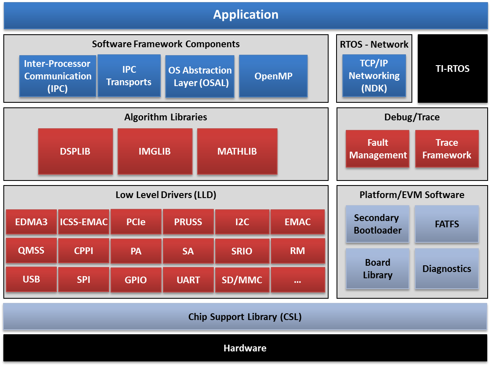
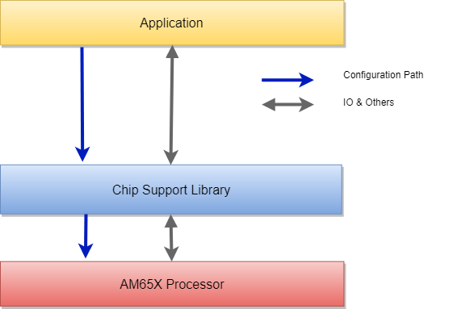

########################################################
Chip Support Library Design Document
########################################################

.. raw:: latex

    \newpage

**Revision History**

======= ============ =============== =================== ========
Version Date         Author          Change History      Status
======= ============ =============== =================== ========
A       26-Jul-2019  Aravind Batni,  Initial version     Released
                     Hao Zhang,
                     Raj Sivarajan
------- ------------ --------------- ------------------- --------
B       23-May-2020  Raj Sivarajan   Updated req tags    Released
------- ------------ --------------- ------------------- --------
C       01-May-2020  Aravind Batni   Updated req tags    Released
------- ------------ --------------- ------------------- --------
D       20-Aug-2020  Sam Nelson      Update ECC design   Released
                     Siluvaimani     for EDC control
------- ------------ --------------- ------------------- --------
E       04-Sept-2020 Aravind Batni   Update to new TIMER Released
                                     APIs for arg check
------- ------------ --------------- ------------------- --------
F       15-Sept-2020 Aravind Batni   Update to new RAT   Released
                                     APIs for arg check
======= ============ =============== =================== ========

.. raw:: latex

    \newpage
    

************
Introduction
************

This document provides the software design and API details of the Chip Support Library (CSL) for the AM65x processor family that are implemented with functional safety quality.

Functional Overview
===================

The Chip Support Library provides low-level hardware abstraction software and API to configure and control different parts of the SOC. The Chip Support Library constitutes a set of well-defined API that abstract low-level details of the underlying SoC device so that a user can configure, control (start/stop, etc.) and have read/write access to peripherals without having to worry about register bit-field details. The CSL services are implemented as distinct modules that correspond with the underlying SoC device modules themselves. By design, CSL API follow a consistent style, uniformly across different processor architectures and are independent of the Operating System. This helps in improving portability of code written using the CSL.

CSL is realized as twin-layer – a basic register-layer and a more abstracted functional-layer. The lower register layer comprises of a very basic set of macros and type definitions. The upper functional layer comprises of “C” functions that provide an increased degree of abstraction, but intended to provide “directed” control of underlying hardware.

It is important to note that CSL does not manage data-movement over underlying hardware devices. Such functionality is considered a prerogative of a device-driver and serious effort is made to not blur the boundary between device-driver and CSL services in this regard. Device drivers are written on top of the CSL.

CSL does not model the device state machine. However, should there exist a mandatory sequence of register reads/writes dictated by the hardware, CSL does indeed support services for such operations.

The CSL services are decomposed into modules, each following the twin-layer of abstraction described above. The API of each such module are completely orthogonal (one module’s API does not internally call API of another module) and do not allocate memory dynamically from within. This is key to keeping CSL scalable to fit various usage scenarios.

Below figure shows the CSL interaction with system.

   **Figure 1**: System interaction diagram

..

Assumptions and Constraints
===========================

This functional safety quality Chip Support Library is expected to be called by the application in privilege mode on the R5F MCU Island of the AM65X processor.

The hardware blocks supported with a baseline quality and can be found in the generally available Processor SDK RTOS for AM65x. See the *Release Notes* for a list of hardware blocks that are supported for functional safety application.

Relationship to Other Architecture Documents
============================================

The implementation of the CSL API are done as per the *AM65x Processors Technical Reference Manual*.                                                                                                                                             
There is no other architecture document for the CSL software as the high level design is captured in this document.

Stakeholders
============

This document is meant for software developers who will use the design information as reference
for software implementation.
                                                                                                                                                                                                                                                                                                                                                                                    
Notational Conventions
======================

See `Directory`_.

Glossary
========

See `Directory`_.

References
==========

See `Directory`_.

Features Not Supported
======================

See *Software Product Specification*.

******************
Design Description
******************

Functional/Logical Viewpoint
============================

Overview
---------
The following block diagram represents the interaction of the different modules with a bare-metal application running without an Operating System. CSL is the lowest software layer to the hardware, it contains software modules with direct access to the processor and peripheral registers.

   **Figure 2**: System interface diagram

..

Directory Structure
--------------------
The source files will be organized with the directory structure

::

    <csl>
        |__arch
        |__soc
        |   |__am65xx < SOC specific files >
        |__src
            |__ip
                |__<ip_source>

..

Component Interaction
---------------------
The CSL interacts with the hardware registers directly.

Supported Modules
------------------

Based on the requirements for this release, the following modules from the MCU Island of the AM65x device are supported:

* CCM: CPU Compare Module
* ECC: Error Correcting Code
* ESM: Error Signaling Module
* CRC: Cyclic Redundancy code
* Lockstep R5F CPU
* Lockstep R5F VIM
* RTI/WWDT: Real Time Interrupt/Windowed Watch Dog Timer
* CBASS: Common Bus Architecture SubSystem (Bus Infrastructure or interconnect)
* RAT: Region Address Translator
* MPU: Memory Protection Unit

CCM: CPU Compare Module
------------------------------------
| Design Id: (did_csl_ccm_read)
| Requirement: REQ_TAG(PDK-6046)

| Design Id: (did_csl_ccm_configure)
| Requirement: REQ_TAG(PDK-6056)

| Design Id: (did_csl_ccm_status)
| Requirement: REQ_TAG(PDK-6057)

| Design Id: (did_csl_ccm_clr_cmp_err)
| Requirement: REQ_TAG(PDK-6055)

CCM for R5 provides API to select the operating modes and read the status for

1. CPU compare block
2. Inactivity monitor
3. VIM compare block

The API for programming the polarity of the CPU signals are also provided. The errors issued by the RTL are routed to the ESM (error signaling module) external to the subsystem.

Please refer to CCM details in *AM65x Processors Technical Reference Manual* for details on this IP.

VIM
------------------------------------

| Design Id: (did_csl_vim_read)
| Requirement: REQ_TAG(PDK-6047)

| Design Id: (did_csl_vim_configure)
| Requirement: REQ_TAG(PDK-6050)

| Design Id: (did_csl_vim_readback)
| Requirement: REQ_TAG(PDK-6047)

| Design Id: (did_csl_vim_ded_configure)
| Requirement: REQ_TAG(PDK-6022)

The Vectored Interrupt Manager (VIM) aggregates interrupts to a CPU.
It is intended for use with a Cortex R5 from ARM in either split or lockstep
configuration. The VIM has up to 1024 interrupt inputs per CPU,
which may be either level or pulse. Each interrupt has a programmable priority (0-
highest through 15-lowest). Each interrupt may also be mapped as an
IRQ or FIQ (FIQ is also often denoted as Non-Maskable Interrupt, or NMI).

R5 CORE
------------------------------------

| Design Id: (did_csl_core_pmu_configure)
| Requirement: REQ_TAG(PDK-6048)

| Design Id: (did_csl_core_pmu_set)
| Requirement: REQ_TAG(PDK-6026)

| Design Id: (did_csl_core_pmu_read)
| Requirement: REQ_TAG(PDK-6048)

| Design Id: (did_csl_core_mpu_configure)
| Requirement: REQ_TAG(PDK-6023)

| Design Id: (did_csl_core_mpu_read)
| Requirement: REQ_TAG(PDK-6023)

| Design Id: (did_csl_core_mpu_check)
| Requirement: REQ_TAG(PDK-6023)

| Design Id: (did_csl_core_rat_read)
| Requirement: REQ_TAG(PDK-6032)  REQ_TAG(PDK-6025)

| Design Id: (did_csl_core_rat_setup_ctrl)
| Requirement: REQ_TAG(PDK-6032)  REQ_TAG(PDK-6025)

| Design Id: (did_csl_core_rat_check)
| Requirement: REQ_TAG(PDK-6032) REQ_TAG(PDK-6025)

| Design Id: (did_csl_core_hard_err_cache_access)
| Requirement: REQ_TAG(PDK-6037)

R5 Core API are provided under CSL to address below:

1. Performance Monitoring Unit (PMU) counter API
2. Memory Protection Unit (MPU) API
3. Region Address Translation (RAT) API
4. Enable Hard Error Cache API

Some of the RAT APIs are implemented with no argument checking. To meet the functional safety argument checking and not to break backwards compatibility, below approach would be considered.
Add the argument check for the below APIs and return error when CSL API fails.

+-------------------------------------+------------------------------------+
| **Old API Name**                    | **New API**                        |
+=====================================+====================================+
| CSL_ratIsExceptionLoggingEnabled    | CSL_ratIsExceptionLoggingEnabled2  |
+-------------------------------------+------------------------------------+

ECC Aggregator
------------------------------------
| Design Id: (did_csl_ecc_aggr_read)
| Requirement: REQ_TAG(PDK-6030) REQ_TAG(PDK-5886)

| Design Id: (did_csl_ecc_aggr_write)
| Requirement: REQ_TAG(PDK-6040)  REQ_TAG(PDK-5893)

| Design Id: (did_csl_ecc_aggr_config)
| Requirement: REQ_TAG(PDK-6040) REQ_TAG(PDK-6058) REQ_TAG(PDK-5893)

| Design Id: (did_csl_ecc_aggr_intr)
| Requirement: REQ_TAG(PDK-6038) REQ_TAG(PDK-5861) REQ_TQG(PDK-5886)

To increase functional safety and system reliability of the memories (for example, FIFOs, queues, SRAMs
and others), many device modules and subsystems are protected by Error Correcting Code (ECC). This
is accomplished through an ECC aggregator and ECC wrapper.

The ECC aggregator is connected to
these memories (hereinafter ECC RAMs) and involved in the ECC process. Each memory is surrounded
by an ECC wrapper which performs the ECC detection and correction. The wrapper communicates via
serial interface with the aggregator which has memory mapped configuration interface.

The ECC aggregator is also connected to interconnect ECC components that protect the command,
address and data buses of the system interconnect. ECC is calculated for the data bus and parity and
redundancy for the command and address buses. Each interconnect ECC component has the same serial
interface for communication with the aggregator as the ECC wrapper. An ECC aggregator may be
connected to both endpoints - the ECC wrapper and interconnect ECC component.

The ECC aggregator, ECC wrapper and interconnect ECC component are considered as a single entity and
are hereinafter referred to as ECC aggregator unless otherwise explicitly specified.

Note the software APIs need to handle ECC wrapper for memory units and the interconnect EDC wrapper for the bus signals.

The design focuses on CSL function layer providing the configuration for ECC RAM ID,
force ECC ram error, ECC aggregator interrupt handling features.

Error Signaling Module (ESM)
------------------------------

| Design Id: (did_csl_esm_err_foce_mode)
| Requirement: REQ_TAG(PDK-6054)

| Design Id: (did_csl_esm_readback)
| Requirement: REQ_TAG(PDK-6036)

| Design Id: (did_csl_handle_esm_cfg_err_int)
| Requirement: REQ_TAG(PDK-6028) REQ_TAG(PDK-6031)

| Design Id: (did_csl_esm_init_sequence)
| Requirement: REQ_TAG(PDK-6031)

| Design Id: (did_csl_esm_rw_raw_status)
| Requirement: REQ_TAG(PDK-6028) REQ_TAG(PDK-6027)

The Error Signaling Module (ESM) aggregates safety-related events and/or errors from throughout the
device into one location. It can signal both low and high priority interrupts to a processor to deal with a
safety event and/or manipulate an I/O error pin to signal an external hardware that an error has occurred.
Therefore an external controller is able to reset the device or keep the system in a safe, known state.

The CSL API provide the following functionalities:

1. API to read back ESM registers (PDK-6036)
2. API to set the ESM error forcing mode (PDK-6054)
3. API for ESM initialization sequence/configurations (PDK-6031)
4. API for ESM Raw error status (PDK-6027)

Cyclic Redundancy Check Module (CRC)
------------------------------------

| Design Id: (did_csl_crc)
| Requirement: REQ_TAG(PDK-6049) REQ_TAG(PDK-6029) REQ_TAG(PDK-6043) REQ_TAG(PDK-6034) REQ_TAG(PDK-6035) REQ_TAG(PDK-6051)

The CRC Module performs CRC (Cyclic Redundancy Check) to verify the integrity of a memory system. 
A signature representing the contents of the memory is obtained when the contents of the memory 
are read into CRC module. The responsibility of CRC module is to calculate the signature 
for a set of data and then compare the calculated signature value against a predetermined
reference signature value.

The CRC module provides API to do the following functionalities:

1. API to read CRC registers (PDK-6029)
2. API to configure registers (PDK-6043)
3. API to manage interrupts (PDK-6034)
4. Software shall provide ability to utilize CRC module (PDK-6035)
5. API to readback of static configuration (PDK-6051)

Real Time Interrupt (RTI) module with Windowed Watchdog Timer (WWDT)
----------------------------------------------------------------------

| Design Id: (did_csl_rti_dwwt)
| Requirement: REQ_TAG(PDK-6039) REQ_TAG(PDK-6053) REQ_TAG(PDK-6042)

The Windowed Watchdog Timer (WWDT) generates reset after a programmable
period, if not serviced within that period. This time-out
boundary is configurable.
The windowed feature allows the start time
boundary to be configurable. The WWDT can generate Reset or
Interrupt, if not serviced within window (Open Window) defined by
start time and time-out boundary. Also the WWDT can generate Reset or
Interrupt if serviced outside Open Window (within Closed Window).
Generation of Reset or Interrupt depends on the WWDT Reaction
configuration.

The WWDT opens a configurable time window in which the watchdog must be serviced.
Any attempt to service the watchdog outside this time window, or a failure to
service the watchdog in this time window, will cause the watchdog to generate
either a reset or a non-maskable interrupt to the CPU. This is controlled by
configuring the RTIWWDRXNCTRL register. As stated earlier, when the watchdog
needs to be enabled by software, the watchdog counter is disabled on a
system reset. When the WWDT is configured to generate a non-maskable interrupt
on a window violation, the watchdog counter continues to count down.

The RTI_WWD_INT interrupt handler needs to clear the watchdog violation status
flag(s) and then service the watchdog by writing the correct sequence in the
watchdog key RTIWDKEY register. This service will cause the watchdog counter
to get reloaded from the preload value and start counting down.
If the RTI_WWD_INT handler does not service the watchdog in time, it could
count down all the way to zero and wrap around. No second exception for a
time out is generated in this case.

The CSL API provide API to do the following functionalities:

1. API to initialize WWDT registers (PDK-6039)
2. API to use WWDT during normal operations  (PDK-6053)
   These API include operations such as read back of static registers, register get/set operations
3. API to read status of WWDT (PDK-6042)

Common Bus Architecture Subsystem Module (CBASS)
------------------------------------------------

| Design Id: (did_csl_cbass)
| Requirement: REQ_TAG(PDK-6045) REQ_TAG(PDK-6033) REQ_TAG(PDK-6044)

The CBASS implements a CBA 4.0 compliant interconnect. It supports the following modules:

1. CBASS QoS
2. CBASS Error Reporting and interrupt

The CBASS module provides API to do the following functionalities:

1. API to read back CBASS registers (PDK-6045)
2. API to configure CBASS QoS registers (PDK-6033)
3. API to read back static configuration registers (PDK-6044)

Dual Mode Timer module (DMTIMER) (TIMER)
----------------------------------------------------------------------

| Design Id: (did_csl_dmtimer)
| Requirement: REQ_TAG(PDK-6041) REQ_TAG(PDK-6052) REQ_TAG(PDK-6024)

The timer module contains a free running upward counter with auto reload capability on overflow. The
timer counter can be read and written in real-time (while counting). The timer module includes compare
logic to allow an interrupt event on a programmable counter matching value.
A dedicated output signal can be pulsed or toggled on overflow and match event. This output offers a
timing stamp trigger signal or PWM (pulse-width modulation) signal sources. A dedicated output signal can
be used for general purpose PORGPOCFG (directly driven by bit 14 of the TCLR register). A dedicated
input signal is used to trigger automatic timer counter capture and interrupt event, on programmable input
signal transition type.

The Capture and Compare modes are disabled by default after the core reset.
The timer can issue an overflow interrupt, a timer match interrupt and a timer capture interrupt.
Each interrupt source can be independently enabled and disabled in the interrupt-enable register.

Each timer supports three functional modes.

1) Timer Mode

 The timer is an upward counter that can be started and stopped at any time through the timer control register. In one-shot mode (the TIMER_TCLR[1] AR bit is set to 0), the counter is stopped after counting overflow occurs (the counter value remains at 0). When the auto reload mode is enabled (the TIMER_TCLR[1] AR bit is set to 1), TIMER_TCRR is reloaded with the value of TIMER_TLDR after a counting overflow occurs.

2) Capture Mode

 When a transition is detected on the module input pin (PIEVENTCAPT), the timer value in the TIMER_TCRR can be captured and saved in the TIMER_TCAR1 or TIMER_TCAR2 register function of the mode selected in the TIMER_TCLR[13] CAPT_MODE bit. The edge detection circuitry monitors transitions on the input pin (PIEVENTCAPT).

3) Compare Mode

 When the compare-enable register TIMER_TCLR[6] CE bit is set to 1, the timer value (the TIMER_TCRR[31-0] TIMER_COUNTER bit field) is continuously compared to the value held in the timer match register (TIMER_TMAR). The value of the TIMER_TMAR[31-0] COMPARE_VALUE bit field can be loaded at any time (timer counting or stopped). When the TIMER_TCRR and the TIMER_TMAR values match, an interrupt is issued, if the TIMER_IRQSTATUS_SET[0] MAT_EN_FLAG bit is set. To prevent any unwanted interrupts due to reset value matching effect, write a compare value to the TIMER_TMAR before setting the TIMER_TCLR[6] CE bit. The dedicated output pin (POTIMERPWM) can be programmed in the TIMER_TCLR[12] PT bit through the TIMER_TCLR[11-10] TRG bit field to generate one positive pulse (timer clock duration) or to invert the current value (toggle mode) when an overflow or a match occurs.

The CSL API provide API to do the following functionalities:

1. API to support for configuring dmTimer (PDK-6041)
2. API to support for software readback of written configurations  (PDK-6052)
3. API to read back dmTimer static registers (PDK-6024)

Process/Concurrency Viewpoint
=============================
Each CSL API is independent, without any sequence or memory/state information.

Sequence Diagrams
------------------
Not Applicable

Resource Definitions
---------------------
CSL will consume memory for program code only, there is no requirement for data memory. Additional resource is cycle time for each API. The memory resources that SDL uses for code/data and the cycle time for the API will be measured and documented.

Interrupt Service Routines
--------------------------
Not Applicable - The interrupt service routines (ISR) will be registered as part of the customer application.

Error Handling
---------------
Arguments passed to CSL API are validated for NULL pointers/invalid values in the C Source files. 
There are some legacy Timer APIs that are already in use by many customers as below:They do not return CSL success/failures.

1. TIMERCounterGet 
2. TIMERReloadGet 
3. TIMERCompareGet 
4. TIMERIntRawStatusGet 
5. TIMERIntStatusGet 
6. TIMERIntEnableGet 
7. TIMERWritePostedStatusGet 
8. TIMERTOWRGet  

To meet the functional safety argument checking and not to break backwards compatibility, below approach would be considered.

1. Have a new API for above APIs that calls the older API along with argument checking. 

2. The Older API would be removed from published interface APIs documentation (doxygen), so that any new customers would not be using the old API. However, the implementation would still be retained in the library to maintain backwards compatibility.

Below table shows the counterpart APIs (new) for above old APIs.

+---------------------------+-----------------------------+
| **Old API Name**          | **New API**                 |
+===========================+=============================+
| TIMERCounterGet           | TIMERCounterGet2            |
+---------------------------+-----------------------------+
| TIMERReloadGet            | TIMERReloadGet2             |
+---------------------------+-----------------------------+
| TIMERCompareGet           | TIMERCompareGet2            |
+---------------------------+-----------------------------+
| TIMERIntRawStatusGet      | TIMERIntRawStatusGet2       |
+---------------------------+-----------------------------+
| TIMERIntStatusGet         | TIMERIntStatusGet2          |
+---------------------------+-----------------------------+
| TIMERIntEnableGet         | TIMERIntEnableGet2          |
+---------------------------+-----------------------------+
| TIMERWritePostedStatusGet | TIMERWritePostedStatusGet2  |
+---------------------------+-----------------------------+
| TIMERTOWRGet              | TIMERTOWRGet2               |
+---------------------------+-----------------------------+

Context Viewpoint
=================
CSL is developed as safety element out of context (SEooC).

************************************
Decision Analysis & Resolution (DAR)
************************************

Design Decision on Readback Verify of Writes
============================================

Design decision on whether to implement a read following each write to verify that the write was completed properly.

.. _Design_Decision_ReadBack_Verify_of_Writes_DAR_Criteria:

DAR Criteria
------------

Criteria is to take the approach that will reduce failure modes and allow flexibility to application.

Available Alternatives
----------------------

There were two alternatives that were considered.

.. _Design_Decision_ReadBack_Verify_Of_Writes_DAR_Alternative_1:

Alternative 1
~~~~~~~~~~~~~

Implement a readback and compare for every write operation within each CSL API. This increases cycle count for this API.

.. _Design_Decision_ReadBack_Verify_Of_Writes_DAR_Alternative_2:

Alternative 2
~~~~~~~~~~~~~

If one does not exist, create new API to read register. This way, the application is responsible to call two CSL API functions to write, read, and compare results. The underlying CSL write API cycle count does not increase for this check.

Final Decision
--------------

Final decision is to select Alternative 2 to have separate CSL API for read and write, and have the application do the comparison. This provides an performance optimal write API and allow the application to implement a readback-verify if needed.

*****
Risks
*****

Not applicable - Risks are tracked at project level.

*************************
Requirements Traceability
*************************

See the Traceability Report.

***************
API Definitions
***************
This section contains the public CSL API.

Modules API
============================================
CCM: Interfaces
-----------------

The interfaces for CCM are defined as below.

Please refer to `CCM API doxygen <../../API-docs/csl/group___c_s_l___m_c_u___a_r_m_s_s___c_c_m_r5___a_p_i.html>`_ that describes the details on the CCM interface API.

.. tiapifunc::    CSL_armR5ReadCCMRegister
.. tiapifunc::    CSL_armR5ConfigureCCMRegister
.. tiapifunc::    CSL_armR5CCMSetOperationModeKey
.. tiapifunc::    CSL_armR5CCMGetCompareError
.. tiapifunc::    CSL_armR5CCMGetOperationModeKey
.. tiapifunc::    CSL_armR5CCMClearCompareError

..

VIM: Interfaces
----------------

The interfaces for VIM are defined as below.

Please refer to `VIM API doxygen <../../API-docs/csl/group___c_s_l___v_i_m___a_p_i.html>`_ that describes the details on the VIM interface API.

.. tiapifunc::    CSL_vimGetRevision
.. tiapifunc::    CSL_vimGetNumIntrs
.. tiapifunc::    CSL_vimGetDedVectorAddr
.. tiapifunc::    CSL_vimGetActivePendingIntr
.. tiapifunc::    CSL_vimGetIrqVectorAddress
.. tiapifunc::    CSL_vimGetFiqVectorAddress
.. tiapifunc::    CSL_vimGetGroupsIntrPending
.. tiapifunc::    CSL_vimGetGroupIntrPending
.. tiapifunc::    CSL_vimReadBackStaticRegs
.. tiapifunc::    CSL_vimCfgIntr
.. tiapifunc::    CSL_vimSetIntrPending
.. tiapifunc::    CSL_vimClrIntrPending
.. tiapifunc::    CSL_vimAckIntr
.. tiapifunc::    CSL_vimSetIntrEnable
.. tiapifunc::    CSL_vimVerifyCfgIntr
.. tiapifunc::    CSL_vimGetIntrType
.. tiapifunc::    CSL_vimSetDedVectorAddr

R5 CORE: Interfaces
------------------------

The interfaces for R5 CORE are defined as below.

Please refer to R5 CORE API doxygen details for below:

1. `PMU API doxygen <../../API-docs/csl/group___c_s_l___a_r_m___r5___p_m_u___a_p_i.html>`_ that describes the details on the PMU interface API.
2. `MPU API doxygen <../../API-docs/csl/group___c_s_l___a_r_m___r5___m_p_u___a_p_i.html>`_ that describes the details on the MPU interface API.
3. `RAT API doxygen <../../API-docs/csl/group___c_s_l___r_a_t___a_p_i.html>`_ that describes the details on the RAT interface API.
4. `Hard Error Cache API doxygen <../../API-docs/csl/group___c_s_l___a_r_m___r5___h_a_r_d___e_r_r___c_a_c_h_e___a_p_i.html>`_ that describes the details on the Hard Error Cache interface API.

.. tiapifunc:: CSL_armR5PmuCfg
.. tiapifunc:: CSL_armR5PmuEnableAllCntrs
.. tiapifunc:: CSL_armR5PmuCfgCntr
.. tiapifunc:: CSL_armR5PmuEnableCntrOverflowIntr
.. tiapifunc:: CSL_armR5PmuEnableCntr
.. tiapifunc:: CSL_armR5PmuClearCntrOverflowStatus
.. tiapifunc:: CSL_armR5PmuResetCycleCnt
.. tiapifunc:: CSL_armR5PmuResetCntrs
.. tiapifunc:: CSL_armR5PmuSetCntr
.. tiapifunc:: CSL_armR5PmuGetNumCntrs
.. tiapifunc:: CSL_armR5PmuReadCntr
.. tiapifunc:: CSL_armR5PmuReadCntrOverflowStatus
.. tiapifunc:: CSL_armR5MpuEnable
.. tiapifunc:: CSL_armR5MpuCfgRegion
.. tiapifunc:: CSL_armR5MpuEnableRegion
.. tiapifunc:: CSL_armR5MpuGetNumRegions
.. tiapifunc:: CSL_armR5MpuVerifyCfgRegion
.. tiapifunc:: CSL_armR5MpuVerifyEnableRegion
.. tiapifunc:: CSL_ratGetRevision
.. tiapifunc:: CSL_ratGetMaxRegions
.. tiapifunc:: CSL_ratIsRegionTranslationEnabled
.. tiapifunc:: CSL_ratGetErrMsgDestId
.. tiapifunc:: CSL_ratIsExceptionLoggingEnabled2
.. tiapifunc:: CSL_ratIsIntrPending
.. tiapifunc:: CSL_ratGetExceptionInfo
.. tiapifunc:: CSL_ratSetErrMsgDestId
.. tiapifunc:: CSL_ratEnableExceptionLogging
.. tiapifunc:: CSL_ratDisableExceptionLogging
.. tiapifunc:: CSL_ratSetIntrPending
.. tiapifunc:: CSL_ratClrIntrPending
.. tiapifunc:: CSL_ratAckIntr
.. tiapifunc:: CSL_ratEnableIntr
.. tiapifunc:: CSL_ratDisableIntr
.. tiapifunc:: CSL_ratEnableRegionTranslation
.. tiapifunc:: CSL_ratDisableRegionTranslation
.. tiapifunc:: CSL_ratConfigRegionTranslation
.. tiapifunc:: CSL_ratVerifyConfigRegionTranslation
.. tiapifunc:: CSL_armR5WriteBTCMRegionRegister
.. tiapifunc:: CSL_armR5WriteATCMRegionRegister
.. tiapifunc:: CSL_armR5ReadBTCMRegionRegister
.. tiapifunc:: CSL_armR5ReadATCMRegionRegister
.. tiapifunc:: CSL_armR5CacheEnableHardErrCache

..

ECC Aggregator: Interfaces
------------------------------

The interfaces for ECC aggregator are defined as below.

Please refer to ECC aggregator API doxygen details for below:

`ECC Aggregator API doxygen <../../API-docs/csl/group___c_s_l___e_c_c___a_g_g_r___a_p_i.html>`_ that describes the details on the Ecc Aggr interface API.

.. tiapifunc:: CSL_ecc_aggrGetRevision
.. tiapifunc:: CSL_ecc_aggrGetNumRams
.. tiapifunc:: CSL_ecc_aggrReadEccRamReg
.. tiapifunc:: CSL_ecc_aggrReadEccRamWrapRevReg
.. tiapifunc:: CSL_ecc_aggrReadEccRamCtrlReg
.. tiapifunc:: CSL_ecc_aggrReadEccRamErrCtrlReg
.. tiapifunc:: CSL_ecc_aggrReadEccRamErrStatReg
.. tiapifunc:: CSL_ecc_aggrGetEccRamErrorStatus
.. tiapifunc:: CSL_ecc_aggrReadStaticRegs
.. tiapifunc:: CSL_ecc_aggrWriteEccRamReg
.. tiapifunc:: CSL_ecc_aggrWriteEccRamCtrlReg
.. tiapifunc:: CSL_ecc_aggrWriteEccRamErrCtrlReg
.. tiapifunc:: CSL_ecc_aggrWriteEccRamErrStatReg
.. tiapifunc:: CSL_ecc_aggrForceEccRamError
.. tiapifunc:: CSL_ecc_aggrConfigEccRam
.. tiapifunc:: CSL_ecc_aggrVerifyConfigEccRam
.. tiapifunc:: CSL_ecc_aggrAckIntr
.. tiapifunc:: CSL_ecc_aggrIsEccRamIntrPending
.. tiapifunc:: CSL_ecc_aggrSetEccRamIntrPending
.. tiapifunc:: CSL_ecc_aggrClrEccRamIntrPending
.. tiapifunc:: CSL_ecc_aggrIsIntrPending
.. tiapifunc:: CSL_ecc_aggrIsAnyIntrPending
.. tiapifunc:: CSL_ecc_aggrEnableIntr
.. tiapifunc:: CSL_ecc_aggrDisableIntr
.. tiapifunc:: CSL_ecc_aggrEnableAllIntr
.. tiapifunc:: CSL_ecc_aggrDisableAllIntr
.. tiapifunc:: CSL_ecc_aggrEnableIntrs
.. tiapifunc:: CSL_ecc_aggrDisableIntrs
.. tiapifunc:: CSL_ecc_aggrEnableAllIntrs
.. tiapifunc:: CSL_ecc_aggrDisableAllIntrs
.. tiapifunc:: CSL_ecc_aggrIntrEnableCtrl
.. tiapifunc:: CSL_ecc_aggrIntrStatusCtrl

.. tiapifunc:: CSL_ecc_aggrReadEDCInterconnectReg
.. tiapifunc:: CSL_ecc_aggrWriteEDCInterconnectReg
.. tiapifunc:: CSL_ecc_aggrConfigEDCInterconnect
.. tiapifunc:: CSL_ecc_aggrVerifyConfigEDCInterconnect
.. tiapifunc:: CSL_ecc_aggrGetEDCInterconnectErrorStatus
.. tiapifunc:: CSL_ecc_aggrForceEDCInterconnectError
.. tiapifunc:: CSL_ecc_aggrIsEDCInterconnectIntrPending
.. tiapifunc:: CSL_ecc_aggrSetEDCInterconnectNIntrPending
.. tiapifunc:: CSL_ecc_aggrClrEDCInterconnectNIntrPending

..

ESM: Interfaces
-----------------

The interfaces for ESM are defined as below.

Please refer to ESM API doxygen details for below:

`ESM API doxygen <../../API-docs/csl/group___c_s_l___e_s_m___a_p_i.html>`_ that describes the details on the ESM interface API.

.. tiapifunc:: ESMSetMode
.. tiapifunc:: ESMGetMode
.. tiapifunc:: ESMGetInfluenceOnErrPin
.. tiapifunc:: ESMGetErrPinLowTimePreload
.. tiapifunc:: ESMGetCurrErrPinLowTimeCnt
.. tiapifunc:: ESMGetErrPinStatus
.. tiapifunc:: ESMGetIntrStatus
.. tiapifunc:: ESMIsEnableIntr
.. tiapifunc:: ESMGetIntrPriorityLvl
.. tiapifunc:: ESMGetGroupIntrStatus
.. tiapifunc:: ESMGetRevisionId
.. tiapifunc:: ESMGetInfo
.. tiapifunc:: ESMGetGlobalIntrEnabledStatus
.. tiapifunc:: ESMReadStaticRegs
.. tiapifunc:: ESMSetInfluenceOnErrPin
.. tiapifunc:: ESMEnableIntr
.. tiapifunc:: ESMSetIntrPriorityLvl
.. tiapifunc:: ESMEnableGlobalIntr
.. tiapifunc:: ESMDisableGlobalIntr
.. tiapifunc:: ESMDisableIntr
.. tiapifunc:: ESMClearIntrStatus
.. tiapifunc:: ESMWriteEOI
.. tiapifunc:: ESMSetErrPinLowTimePreload
.. tiapifunc:: ESMResetErrPin
.. tiapifunc:: ESMReset
.. tiapifunc:: ESMSetIntrStatusRAW
.. tiapifunc:: ESMGetIntrStatusRAW

..

CRC: Interfaces
-------------------

The interfaces for CRC are defined as below.

Please refer to CRC API doxygen details for below:

`CRC API doxygen <../../API-docs/csl/group___c_s_l___c_r_c.html>`_ that describes the details on the CRC interface API.

.. tiapifunc:: CRCInitialize
.. tiapifunc:: CRCVerifyInitialize
.. tiapifunc:: CRCConfigure
.. tiapifunc:: CRCVerifyConfigure
.. tiapifunc:: CRCChannelReset
.. tiapifunc:: CRCGetPSASigRegAddr
.. tiapifunc:: CRCGetPSASig
.. tiapifunc:: CRCSetPSASeedSig
.. tiapifunc:: CRCGetPSASectorSig
.. tiapifunc:: CRCGetHighestPriorityIntrStatus
.. tiapifunc:: CRCGetIntrStatus
.. tiapifunc:: CRCEnableIntr
.. tiapifunc:: CRCDisableIntr
.. tiapifunc:: CRCClearIntr
.. tiapifunc:: CRCPowerDownCtrl
.. tiapifunc:: CRCIsBusy
.. tiapifunc:: CRCGetCurSecNum
.. tiapifunc:: CRCGetCurPSASig
.. tiapifunc:: CRCGetRawData
.. tiapifunc:: CRCDataBusTracingCtrl
.. tiapifunc:: CRCVerifyBusTracingCtrl
.. tiapifunc:: CRCReadStaticRegs

RTI_WWDT: Interfaces
-----------------------

The interfaces for RTI_WWDT are defined as below.

Please refer to RTI_WWDT API doxygen details for below:

`RTI_WWDT API doxygen <../../API-docs/csl/group___c_s_l___r_t_i.html>`_ that describes the details on the RTI_WWDT interface API.

.. tiapifunc:: RTI_DWWDReadStaticRegs
.. tiapifunc:: RTIDwwdWindowConfig
.. tiapifunc:: RTIDwwdWindowVerifyConfig
.. tiapifunc:: RTIDwwdCounterEnable
.. tiapifunc:: RTIDwwdService
.. tiapifunc:: RTIDwwdGetLastResetStatus 
.. tiapifunc:: RTIDwwdSetPreload
.. tiapifunc:: RTIDwwdSetReaction
.. tiapifunc:: RTIDwwdSetWindowSize
.. tiapifunc:: RTIDwwdIsClosedWindow
.. tiapifunc:: RTIDwwdGenerateSysReset 
.. tiapifunc:: RTIDwwdGetStatus 
.. tiapifunc:: RTIDwwdClearStatus 
.. tiapifunc:: RTIDwwdGetCurrentDownCounter
.. tiapifunc:: RTIIsDwwdKeySequenceCorrect
.. tiapifunc:: RTIDwwdGetPreload
.. tiapifunc:: RTIDwwdGetWindowSize
.. tiapifunc:: RTIDwwdGetTimeOut
.. tiapifunc:: RTIDwwdGetReaction 
.. tiapifunc:: RTIDwwdGetTicksToOpenWindow

CBASS: Interfaces
-------------------

The interfaces for CBASS are defined as below.

Please refer to CBASS API doxygen details for below:

`CBASS API doxygen <../../API-docs/csl/group___c_s_l___c_b_a_s_s.html>`_ that describes the details on the CBASS interface API.

.. tiapifunc:: CSL_cbassQosSetQos
.. tiapifunc:: CSL_cbassQosGetQos
.. tiapifunc:: CSL_cbassQosSetOrderID
.. tiapifunc:: CSL_cbassQosGetOrderID
.. tiapifunc:: CSL_cbassQosSetEpriority
.. tiapifunc:: CSL_cbassQosGetEpriority
.. tiapifunc:: CSL_cbassQosReadStaticRegs
.. tiapifunc:: CSL_cbassErrGetRevision
.. tiapifunc:: CSL_cbassErrSetDestID
.. tiapifunc:: CSL_cbassErrGetDestID
.. tiapifunc:: CSL_cbassErrGetExcepLogHdr
.. tiapifunc:: CSL_cbassErrGetExcepLogData
.. tiapifunc:: CSL_cbassErrSetIntrRawStatus
.. tiapifunc:: CSL_cbassErrGetIntrRawStatus
.. tiapifunc:: CSL_cbassErrClearIntr
.. tiapifunc:: CSL_cbassErrGetIntrStatus
.. tiapifunc:: CSL_cbassErrEnableIntr
.. tiapifunc:: CSL_cbassErrDisableIntr
.. tiapifunc:: CSL_cbassErrSetEOI
.. tiapifunc:: CSL_cbassErrGetEOI
.. tiapifunc:: CSL_cbassErrReadStaticRegs

TIMER: Interfaces
-------------------

The interfaces for TIMER are defined as below.

Please refer to TIMER API doxygen details for below:

`TIMER API doxygen <../../API-docs/csl/group___c_s_l___t_i_m_e_r.html>`_ that describes the details on the TIMER interface API.

.. tiapifunc::    	TIMEREnable
.. tiapifunc::    	TIMERDisable
.. tiapifunc::    	TIMERModeConfigure
.. tiapifunc::    	TIMERModeConfigureGet
.. tiapifunc::    	TIMERPreScalerClkEnable
.. tiapifunc::    	TIMERPreScalerClkDisable
.. tiapifunc::    	TIMERCounterSet
.. tiapifunc::    	TIMERCounterGet2
.. tiapifunc::    	TIMERReloadSet
.. tiapifunc::    	TIMERReloadGet2
.. tiapifunc::    	TIMERGPOConfigure
.. tiapifunc::    	TIMERGPOConfigureGet
.. tiapifunc::    	TIMERCompareSet
.. tiapifunc::    	TIMERCompareGet2
.. tiapifunc::    	TIMERIntRawStatusSet
.. tiapifunc::    	TIMERIntRawStatusGet2
.. tiapifunc::    	TIMERIntStatusGet2
.. tiapifunc::    	TIMERIntStatusClear
.. tiapifunc::    	TIMERIntEnable
.. tiapifunc::    	TIMERIntDisable
.. tiapifunc::    	TIMERWakeEnable
.. tiapifunc::    	TIMERWakeDisable
.. tiapifunc::    	TIMERTriggerSet
.. tiapifunc::    	TIMERIntEnableGet2
.. tiapifunc::    	TIMERResetConfigure
.. tiapifunc::    	TIMERResetConfigureGet
.. tiapifunc::    	TIMERReset
.. tiapifunc::    	TIMERContextSave
.. tiapifunc::    	TIMERContextRestore
.. tiapifunc::    	TIMERPostedModeConfig
.. tiapifunc::    	TIMERPostedModeConfigGet
.. tiapifunc::    	TIMERWritePostedStatusGet2
.. tiapifunc::    	TIMERIdleModeConfigure
.. tiapifunc::    	TIMERIdleModeConfigureGet
.. tiapifunc::    	TIMEREmuModeConfigure
.. tiapifunc::    	TIMEREmuModeConfigureGet
.. tiapifunc::    	TIMERReadModeConfig
.. tiapifunc::    	TIMERReadModeConfigGet
.. tiapifunc::    	TIMERTPIRSet
.. tiapifunc::    	TIMERTPIRGet
.. tiapifunc::    	TIMERTNIRSet
.. tiapifunc::    	TIMERTNIRGet
.. tiapifunc::    	TIMERTCVRSet
.. tiapifunc::    	TIMERTCVRGet
.. tiapifunc::    	TIMERTOCRSet
.. tiapifunc::    	TIMERTOCRGet
.. tiapifunc::    	TIMERTOWRGet2
.. tiapifunc::    	TIMERTOWRSet
.. tiapifunc::    	TIMERGetStaticRegs

..

*********************************************
Directory
*********************************************

Index
=============================================
None

Glossary
=============================================
None

Acronym List
=============================================

================ ====
Acronym          Definition
================ ====
API              Application Programming Interface
---------------- ----
CBASS            Common Bus Architecture Sub System
---------------- ----
CCM              CPU Compare Module
---------------- ----
CRC              Cyclic Redundancy Checker
---------------- ----
CSL              Chip Support Library
---------------- ----
ECC              Error Correcting Code
---------------- ----
ISR              Interrupt Service Routine
---------------- ----
MPU              Memory Protection Unit
---------------- ----
RAT              Region Address Translator
---------------- ----
SEooC            Safety Element out of Context
---------------- ----
SDL              SafeTI Diagnostics Library
---------------- ----
SOC              System On Chip
---------------- ----
VIM              Vectored Interrupt Manager
---------------- ----
WDT              Watchdog Timer
================ ====

References
=============================================

#. **AM65x SafeTI SW 1.0: Software Product Specification**, Rev A

#. **AM65x Processors Safety Manual**, Revised March 2019 (SPRUIJ5, https://www.ti.com/securesoftware/docs/securesoftwarehome.tsp)

#. **AM65x Processors Technical Reference Manual**, Rev D, June 2019 (SPRUID7, http://www.ti.com/lit/pdf/spruid7)

#. **AM65x Processors SR1.0 Silicon Errata**, Rev B, February 2019 (SPRZ452, http://www.ti.com/lit/pdf/sprz452)

#. **Cortex-R5 and Cortex-R5F Technical Reference Manual**, Rev r1p1 (DDI0460C, http://infocenter.arm.com/help/topic/com.arm.doc.ddi0460c/DDI0460C_cortexr5_trm.pdf)

.. raw:: latex

    \newpage

**Template Revision**

+---------------+----------------------+-----------------+--------------------------------------------------------------------------------------------------------------------------+
| **Version**   | **Date**             | **Author**      | **Description**                                                                                                          |
+===============+======================+=================+==========================================================================================================================+
| 0.01          | November 2017        | Jon Nafziger    | Initial version                                                                                                          |
+---------------+----------------------+-----------------+--------------------------------------------------------------------------------------------------------------------------+
| 0.02          | July 12, 2018        | Krishna Allam   | Updates to synchronize this SDD template with the methodology described in the Software Architecture document template   |
+---------------+----------------------+-----------------+--------------------------------------------------------------------------------------------------------------------------+
| 1.0           | September 19, 2018   | Frank Fruth     | Updates:                                                                                                                 |
|               |                      |                 |                                                                                                                          |
|               |                      |                 | -  Added a separate section/table for template revision (this table).                                                    |
|               |                      |                 |                                                                                                                          |
|               |                      |                 | -  Cleared revision history at start of document to be reserved for document revision                                    |
|               |                      |                 |                                                                                                                          |
|               |                      |                 | -  Minor cosmetic changes to title page, e.g., removed literature number reference;                                      |
+---------------+----------------------+-----------------+--------------------------------------------------------------------------------------------------------------------------+
| 1.0A          | November 19, 2018    | Sam Nelson      | Updates:                                                                                                                 |
|               |                      | Siluvaimani     |                                                                                                                          |
|               |                      |                 | -  Converted to RST format                                                                                               |
+---------------+----------------------+-----------------+--------------------------------------------------------------------------------------------------------------------------+
| 1.0B          | January 15, 2019     | Sam Nelson      | Updates:                                                                                                                 |
|               |                      | Siluvaimani     |                                                                                                                          |
|               |                      |                 | -  Some formatting changes and handling of references updated                                                            |
+---------------+----------------------+-----------------+--------------------------------------------------------------------------------------------------------------------------+

