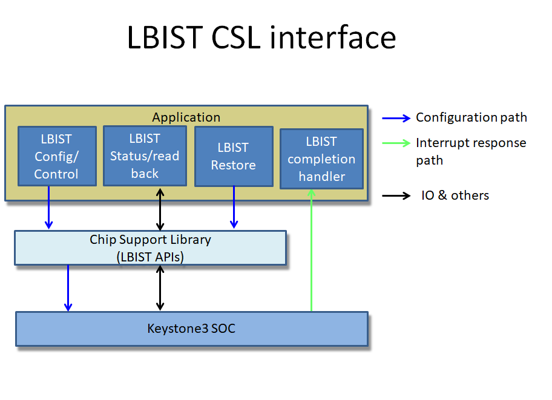
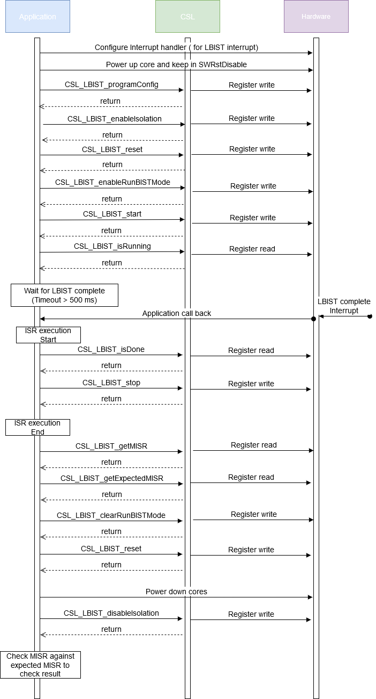

###############################################
LBIST Design Document
###############################################

.. raw:: latex

    \newpage

**Revision History**

=============== ============ ============= ================================ =========
Version         Date         Author        Change History                   Status
=============== ============ ============= ================================ =========
A               20-Jul-2020  Sam Nelson    Initial Version                  Reviewed
                             Siluvaimani
--------------- ------------ ------------- -------------------------------- ---------
B               28-Jul-2020  Sam Nelson    Review comments addressed        Released
                             Siluvaimani
=============== ============ ============= ================================ =========

.. raw:: latex

    \newpage

************
Introduction
************

Overview
=========
This document provides the software design for the support of the Logical Built-In Self Test (LBIST) modules in the Chip Support Library(CSL).

Purpose and Scope
=================
The purpose of this document is to define the software design for supporting LBIST module through CSL APIs.

This program is following the QRAS AP00216 SW Development Process for Functional Safety Quality.

Assumptions and Constraints
===========================
None

Relationship to Other Architecture Documents
============================================

CSL overall design is covered in the Chip_Support_Library_Design.pdf and is part of the Safety CSP release.

Stakeholders
===================

+----------------------+-----------------------------------------------------------------------------------+
| TI SW Developers     | SW developers can refer to this design for developing diagnostic SW using LBIST   |
+----------------------+-----------------------------------------------------------------------------------+

Notational Conventions
======================

Notes
-----

***Note:***

None

Glossary
========

See `Directory`_.

References
==========

.. _[1]:

1. **J721E DRA829/TDA4VM/AM752x Processors, Silicon Revision 1.0**, Revision: Nov 2019 (SPRU1L1A, https://www.ti.com/lit/pdf/spruil1)

.. _[2]:

2. **DRA829/TDA4VM Safety Manual Jacinto™ 7 Processors**, Revision: December 2019, SPRUIR1_DRA829_TDA4VM_Safety_Manual_F3_draft.pdf.

.. _[3]:

3. **Chip Support Library Design document**, Revision C, May 2020, Chip_Support_Library_Design.pdf.

Features Not Supported
======================
N/A

******************
Design Description
******************

Functional/Logical Viewpoint
============================

Overview
---------

Built in Self test (BIST) is a feature that allows self testing of the memory areas and logic circuitry in an Integrated Circuit (IC) without any external test equipment.

These features are in general used to do production testing of the IC. But the same features are now extended to be used for run time testing of a System on a Chip (SOC).

In an embedded system, these test features are typically used during boot time or shutdown of the system or during a maintenance period to check the health of an SOC.

Keystone3 devices supports Logical BIST (LBIST) that can be initiated at run time.

There are multiple LBIST instances in the SOC. Individual LBIST instances focus on particular processor cores.

CSL software will support APIs to configure and run LBIST tests. The APIs will be common for all the instances of LBIST and take the Base address of the particular instances as an argument.

Hardware Details
----------------

LBIST
~~~~~~
LBIST, as the name indicates, is used to test the logic circuity in an SOC associated with the CPU cores.  LBIST can be run on the different CPU cores in the SOC, one core at a time.

The software that initiates the LBIST test is to be run on a different core than the one under test. Note that running of LBIST code on MCU R5F to run on itself is not supported, as it will be self destructive.

There are multiple configuration parameters for the LBIST module. Configurations include the clock delay, divide ratio, static, set, rest, scan pattern count definitions and seed configurations. Also the expected signature as the result of the test are stored in EFUSE registers. The software is expected to compare the actual signature obtained part of the test to the expected signature to check the test to pass.

Directory Structure
-------------------

The LBIST CSL functional layer would be implemented with below directory structure.

::

    <csl>
     ├── csl_lbist.h
     src/ip/
           └──lbist/
              ├── src_files_lbist.mk
              └── V0
                  └── csl_lbist.h
                      └── priv
                          └── csl_lbist.c

..

+-------------------------------------------------+-----------------------------------------------------+
| **File Name**                                   | **Description**                                     |
+=================================================+=====================================================+
|csl_lbist.h                                      | Top level LBIST API interface include h file        |
+-------------------------------------------------+-----------------------------------------------------+
|src/ip/lbist/src_files_lbist.mk                  | Makefile for LBIST build                            |
+-------------------------------------------------+-----------------------------------------------------+
|src/ip/lbist/V0/csl_lbist.h                      | LBIST API interface - V0 version for J721e          |
+-------------------------------------------------+-----------------------------------------------------+
|src/ip/lbist/V0/priv/csl_lbist.c                 | LBIST Implementation - V0 version for J721e         |
+-------------------------------------------------+-----------------------------------------------------+

Component Interaction
---------------------

The Chip Support Library (CSL) BIST APIs provide access to program the SOC LBIST configuration registers.

The following block diagram (:numref:`CSL_LBIST_block_diagram`) shows the details about the application interaction with CSL when running LBIST.

.. _CSL_LBIST_block_diagram:

   :LBIST Block diagram

The application, after getting the HW modules in the right power state, will make sequence of CSL calls to configure and prepare the LBIST module. Then the application will initiate the LBIST to start and wait for interrupt event to be triggered once the LBIST test is complete.
The application can call CSL LBIST APIs to get the resulting signature of the test and the expected signature. The application can then compare the signature to decide on test pass.  Also application can call LBIST API to stop and restore to normal operation.

Note that the power operations, to get the cpu core and other related in the right state will be done by the application using API calls outside of the CSL Layer.

..

Interfaces
----------

| Design Id: (did_csl_lbist_interfaces)
| Requirement: REQ_TAG(PDK-5944) REQ_TAG(PDK-5940) REQ_TAG(PDK-5941) REQ_TAG(PDK-5936) REQ_TAG(PDK-5939)

CSL software will support APIs to configure and run LBIST tests. The APIs will be generic and take the base address of the particular instances as argument.

This section captures the interfaces designed to program the LBIST modules. The API functions would validate the arguments for out-of-bound conditions and would also check for “NULL” pointers before programming the LBIST registers.

These APIs are written at design time and the final API may be different. See the Software API Guide for the released API.

With LBIST, CSL will support the following functionality

a) Configure the LBIST: This includes configuring the clock delay, divide ratio, static, set, rest, scan pattern count definitions and seed configurations.

b) Prepare LBIST before start of test: This includes enabling isolation, reset the LBIST and enable run BIST mode.

c) Start LBIST test.

d) Check LBIST results and status: Including running status, getting the signature and expected signatures.

e) Disable LBIST after it is complete: Including disabling test mode, stopping LBIST and resetting LBIST and disable isolation

Please refer to the API definitions section for more details.

Process/Concurrency Viewpoint
=============================

LBIST CSL APIs are independent, memory-less and stateless implementation. The CSL APIs are implemented as simple functions.
Any protection in terms of sharing between multiple tasks need to be taken care in the application.

Sequence Diagrams
-----------------

The following diagram (:numref:`CSL_LBIST_Sequence_diagram`) shows the sequence of operations to be followed to run LBIST.
For details of the API see "API Section".

.. _CSL_LBIST_Sequence_diagram:

   : LBIST Sequence diagram

   
Resource Definitions
--------------------

Actual cycles, program, data memory requirements, will be measured and would be tabulated after the implementation is complete. And the data needs to be captured in the user guide.

LBIST memory footprint
-----------------------

The following table shows the expected memory footprint for the CSL LBIST implementation.

=============== ======================
Parameter       Size
=============== ======================
Constant        0 bytes
--------------- ----------------------
Bss             0 bytes
--------------- ----------------------
Static          0 bytes
--------------- ----------------------
Data            0 bytes
--------------- ----------------------
Stack           < 100 bytes
--------------- ----------------------
Code            < 1 kbytes
=============== ======================

Code size is the size of memory occupied by program. Data is initialized data storage. Bss is uninitialize data. Static is local data to a file or function.
Constant is non-changing data. Stack is data used through the stack pointer.

NOTE: The expection here is that there is no need for Data, Static, Bss or constant sections based on design. All data will be processed on stack.

LBIST cycles performance
~~~~~~~~~~~~~~~~~~~~~~~~~

Running LBIST tests in general will require a sequence of API calls and also the complete test has expectations on how much the test is expected to take.

The expected test time  for each of the LBIST instances are as follows 

+-------------------+---------------------+--------------------+
| CPU core          | Final Pattern Count | Expected test time |
+-------------------+---------------------+--------------------+
| Main R5F0/R5F1    | 16383               | ~20 ms             |
+-------------------+---------------------+--------------------+
| A72               | 11968               | ~20 ms             |
+-------------------+---------------------+--------------------+
| C7x               | 5056                | ~4 ms              |
+-------------------+---------------------+--------------------+
| DMPAC             | 6272                | ~8 ms              +
+-------------------+---------------------+--------------------+
| VPAC              | 5056                | ~6 ms              |
+-------------------+---------------------+--------------------+

Actual cycles, program, data memory requirements would be tabulated after the implementation is complete.

..

Interrupt Service Routines
--------------------------

The ISR routines are needed to be registered from higher layer to handle the LBIST completion interrupts. This would be demonstrated as part of the LBIST test code.

Error Handling
--------------
The CSL APIs check for NULL pointers and out of range arguments and return CSL_EBADARGS error code on these cases.

Each function will document expectations of the returned error ocde.

Context Viewpoint
=================

The LBIST tests are run to make sure the hardware logic or memory is working correctly. This is normally done right at the time before boot up or periodically during down time.

Use Case ID 1
-------------

+------------------------+-----------------------------------------------+
| Use Case ID            | UC-1                                          |
+========================+===============================================+
| Use Case               | Running SW initiated LBIST                    |
+------------------------+-----------------------------------------------+
| Description            | To run diagnostics on a CPU core to make sure |
|                        | the logic circuitry is running without any    |
|                        | issues                                        |
+------------------------+-----------------------------------------------+
| Actor(s)               |  - Application Software initiating LBIST      |
|                        |  - CPU core on which LBIST is run             |
|                        |  - LBIST instance associated with the core    |
+------------------------+-----------------------------------------------+
| Trigger                | Application software initiating LBIST test    |
+------------------------+-----------------------------------------------+
| Primary Scenario       | Application initiating LBIST                  |
+------------------------+-----------------------------------------------+
| Alternative Scenario   |    N/A                                        |
+------------------------+-----------------------------------------------+
| Exceptional Scenario   |    N/A                                        |
+------------------------+-----------------------------------------------+
| Pre-Conditions         | The CPU cores are in pre-requisite condition  |
|                        | where Local Power is set in SWRstDisable      |
|                        | state with the associated Power Domain enabled|
+------------------------+-----------------------------------------------+
| Post-Conditions        | Restore CPU for normal operation              |
+------------------------+-----------------------------------------------+
| Assumptions            |  N/A                                          |
+------------------------+-----------------------------------------------+

************************************
Decision Analysis & Resolution (DAR)
************************************

Given the general design of stateless APIs, the CSL for LBIST will follow the general architecture of CSL APIs. No specific design alternatives considered for BIST.

*****
Risks
*****

* None

***************
API Definitions
***************

Interfaces
==========

LBIST Interfaces
-----------------

The interfaces for LBIST are defined as below.

Please refer to LBIST API doxygen details for API documentation:

`LBIST API doxygen <../../API-docs/csl/group___c_s_l___lbist.html>`_ that describes the details on the LBIST interface API.

Macros and Data Structures
~~~~~~~~~~~~~~~~~~~~~~~~~~~

The following Macros and Data structures are defined.

.. tiapistruct:: CSL_LBIST_config

LBIST Configuration APIs
~~~~~~~~~~~~~~~~~~~~~~~~~

| Design Id: (did_csl_lbist_configuration)
| Requirement: REQ_TAG(PDK-5944)

The following LBIST configuration API is supported.

.. tiapifunc:: CSL_LBIST_programConfig

LBIST Preparation APIs
~~~~~~~~~~~~~~~~~~~~~~~~~

| Design Id: (did_csl_lbist_preparation)
| Requirement: REQ_TAG(PDK-5936)

The following LBIST preparation APIs are supported.

.. tiapifunc:: CSL_LBIST_enableIsolation

.. tiapifunc:: CSL_LBIST_reset

.. tiapifunc:: CSL_LBIST_enableRunBISTMode

LBIST Start/Stop API
~~~~~~~~~~~~~~~~~~~~~

| Design Id: (did_csl_lbist_control)
| Requirement: REQ_TAG(PDK-5939)

The following LBIST API are supported to start or stop the LBIST test.

.. tiapifunc:: CSL_LBIST_start

.. tiapifunc:: CSL_LBIST_stop

LBIST Check result APIs
~~~~~~~~~~~~~~~~~~~~~~~~

| Design Id: (did_csl_lbist_check_result)
| Requirement: REQ_TAG(PDK-5940)

The following APIs are supported to check the status and results for the LBIST test.

.. tiapifunc:: CSL_LBIST_isRunning

.. tiapifunc:: CSL_LBIST_isDone

.. tiapifunc:: CSL_LBIST_getMISR

.. tiapifunc:: CSL_LBIST_getExpectedMISR

LBIST restore APIs
~~~~~~~~~~~~~~~~~~~

| Design Id: (did_csl_lbist_restore)
| Requirement: REQ_TAG(PDK-5941)

The following LBIST APIs are supported to restore after LBIST test.

.. tiapifunc:: CSL_LBIST_disableIsolation

.. tiapifunc:: CSL_LBIST_clearRunBISTMode

..

***************
Test Plan
***************

LBIST test
============

Functional test
-----------------

There are multiple LBIST instances in the SOC. All instances of LBIST need to be covered by testing except the MCU core where the test code is running. See details of the instances that will be tested in the SOC specific section below.

Note the test configuration for each instance include:

* Base address of LBIST instance
* Base address of signature register
* Interrupt number for the particular LBIST instance
* LBIST configuration including: See CSL_LBIST_config_t for details.

(Also you would need the following to power up the appropriate core and associated modules

* Primary processor id.
* Secondary processor id if needed.
* TISCI device id of primary core.
* TISCI device id of secondary core if needed.
* Other associated devices that need to be powered up, if needed for a particular LBIST instance.

)
 
The following sequence will be used to run the tests on each of the instances.

#. Register interrupt handler to handle interrupt associated with the LBIST.
#. Get the cores to the right state.
#. Configure LBIST.
#. Prepare for test.
#. Start LBIST.
#. Wait for LBIST completion interrupt.
#. In ISR, check LBIST Done and stop.
#. If interrupt does not occur within timeout declare error.
#. Check calculated Signature ( MISR).
#. Get expected Signature (Expected MISR).
#. Pass if Signature match with expected Signature. Fail if timed out or if signature mismatch occurs.

J721E specific details
-----------------------

Specific to the J721E there are 6 LBIST instances corresponding to the different CPU cores.
(Note the MCU R5F cores are excluded here, as running on self core will be destructive)

Here are the corresponding base address defines, which are part of the main or wakeup control MMR:

Main R5F0: CSL_CTRL_MMR0_CFG0_BASE->MCU0_LBIST_CTRL

Main R5F1: CSL_CTRL_MMR0_CFG0_BASE->MCU1_LBIST_CTRL

C7X core: CSL_CTRL_MMR0_CFG0_BASE->DSP0_LBIST_CTRL

VPAC: CSL_CTRL_MMR0_CFG0_BASE->VPAC_LBIST_CTRL

DMPAC: CSL_CTRL_MMR0_CFG0_BASE->DMPAC_LBIST_CTRL

A72: CSL_CTRL_MMR0_CFG0_BASE->MPU0_LBIST_CTRL

The corresponding LBIST completion interrupt events are as follows

Main R5F0: CSLR_MCU_R5FSS0_CORE0_INTR_GLUELOGIC_MAIN_PULSAR0_LBIST_GLUE_DFT_LBIST_BIST_DONE_0

Main R5F1: CSLR_MCU_R5FSS0_CORE0_INTR_GLUELOGIC_MAIN_PULSAR1_LBIST_GLUE_DFT_LBIST_BIST_DONE_0

C7x core: CSLR_MCU_R5FSS0_CORE0_INTR_COMPUTE_CLUSTER0_C7X_4_DFT_LBIST_DFT_LBIST_BIST_DONE_0

VPAC: CSLR_MCU_R5FSS0_CORE0_INTR_GLUELOGIC_VPAC_LBIST_GLUE_DFT_LBIST_BIST_DONE_0

DMPAC: CSLR_MCU_R5FSS0_CORE0_INTR_GLUELOGIC_DMPAC_LBIST_GLUE_DFT_LBIST_BIST_DONE_0

A72: CSLR_MCU_R5FSS0_CORE0_INTR_COMPUTE_CLUSTER0_ARM0_DFT_LBIST_DFT_LBIST_BIST_DONE_0

***************
Directory
***************

Index
======

Index is not currently generated.

Glossary
===========

+---------------+-------------------------------------------------------------+
| **Term**      | **Definition**                                              |
+===============+=============================================================+
| SOC           | System-on-Chip, an integrated circuit that incorporates many|
|               | components into a single chip.                              |
+---------------+-------------------------------------------------------------+
| LBIST         | Logical Built-In Self Test                                  |
+---------------+-------------------------------------------------------------+
| ROM           | Read Only Memory                                            |
+---------------+-------------------------------------------------------------+
| CSL           | Chip Support Library                                        |
+---------------+-------------------------------------------------------------+
| MMR           | Memory Mapped register                                      |
+---------------+-------------------------------------------------------------+
| PRPG          | Pseudo Random Pattern Generator                             |
+---------------+-------------------------------------------------------------+
| MISR          | Multiple Input Signature Register                           |
+---------------+-------------------------------------------------------------+

.. raw:: latex

    \newpage

**Template Revision**

+---------------+----------------------+-----------------+--------------------------------------------------------------------------------------------------------------------------+
| **Version**   | **Date**             | **Author**      | **Description**                                                                                                          |
+===============+======================+=================+==========================================================================================================================+
| 0.01          | November 2017        | Jon Nafziger    | Initial version                                                                                                          |
+---------------+----------------------+-----------------+--------------------------------------------------------------------------------------------------------------------------+
| 0.02          | July 12, 2018        | Krishna Allam   | Updates to synchronize this SDD template with the methodology described in the Software Architecture document template   |
+---------------+----------------------+-----------------+--------------------------------------------------------------------------------------------------------------------------+
| 1.0           | September 19, 2018   | Frank Fruth     | Updates:                                                                                                                 |
|               |                      |                 |                                                                                                                          |
|               |                      |                 | -  Added a separate section/table for template revision (this table).                                                    |
|               |                      |                 |                                                                                                                          |
|               |                      |                 | -  Cleared revision history at start of document to be reserved for document revision                                    |
|               |                      |                 |                                                                                                                          |
|               |                      |                 | -  Minor cosmetic changes to title page, e.g., removed literature number reference;                                      |
+---------------+----------------------+-----------------+--------------------------------------------------------------------------------------------------------------------------+
| 1.0A          | November 19, 2018    | Sam Nelson      | Updates:                                                                                                                 |
|               |                      | Siluvaimani     |                                                                                                                          |
|               |                      |                 | -  Converted to RST format                                                                                               |
+---------------+----------------------+-----------------+--------------------------------------------------------------------------------------------------------------------------+
| 1.0B          | January 15, 2019     | Sam Nelson      | Updates:                                                                                                                 |
|               |                      | Siluvaimani     |                                                                                                                          |
|               |                      |                 | -  Some formatting changes and handling of references updated                                                            |
+---------------+----------------------+-----------------+--------------------------------------------------------------------------------------------------------------------------+
