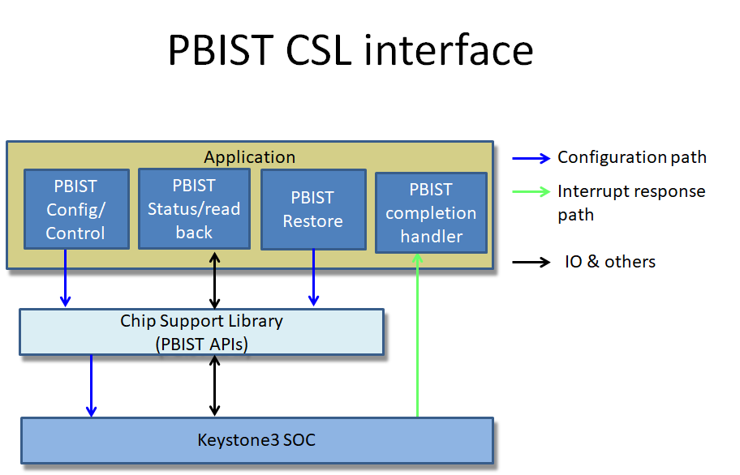
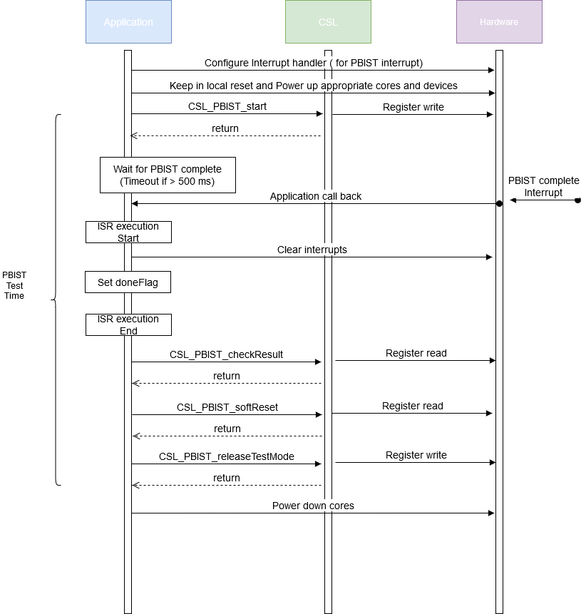

###############################################
PBIST Design Document
###############################################

.. raw:: latex

    \newpage

**Revision History**

=============== ============ ============= ================================ =========
Version         Date         Author        Change History                   Status
=============== ============ ============= ================================ =========
A               20-Jul-2020  Sam Nelson    Initial Version                  Reviewed
                             Siluvaimani
--------------- ------------ ------------- -------------------------------- ---------
B               28-Jul-2020  Sam Nelson    Review comments addressed        Released
                             Siluvaimani
=============== ============ ============= ================================ =========

.. raw:: latex

    \newpage

************
Introduction
************

Overview
=========
This document provides the software design for the support of the Programmable Built-In Self Test (PBIST) module in the Chip Support Library(CSL).

Purpose and Scope
=================
The purpose of this document is to define the software design for supporting PBIST module through CSL APIs.

This program is following the QRAS AP00216 SW Development Process for Functional Safety Quality.

Assumptions and Constraints
===========================
None

Relationship to Other Architecture Documents
============================================

CSL overall design is covered in the Chip_Support_Library_Design.pdf and is part of the Safety CSP release.

Stakeholders
===================

+----------------------+-----------------------------------------------------------------------------------+
| TI SW Developers     | SW developers can refer to this design for developing diagnostic SW using PBIST   |
+----------------------+-----------------------------------------------------------------------------------+

Notational Conventions
======================

Notes
-----

***Note:***

None

Glossary
========

See `Directory`_.

References
==========

.. _[1]:

1. **J721E DRA829/TDA4VM/AM752x Processors, Silicon Revision 1.0**, Revision: Nov 2019 (SPRU1L1A, https://www.ti.com/lit/pdf/spruil1)

.. _[2]:

2. **DRA829/TDA4VM Safety Manual Jacinto™ 7 Processors**, Revision: December 2019, SPRUIR1_DRA829_TDA4VM_Safety_Manual_F3_draft.pdf.

.. _[3]:

3. **Chip Support Library Design document**, Revision C, May 2020, Chip_Support_Library_Design.pdf.

Features Not Supported
======================
N/A

******************
Design Description
******************

Functional/Logical Viewpoint
============================

Overview
---------

Built in Self test (BIST) is a feature that allows self testing of the memory areas and logic circuitry in an Integrated Circuit (IC) without any external test equipment.

These features are in general used to do production testing of the IC. But the same features are now extended to be used for run time testing of a System on a Chip (SOC).

In an embedded system, these test features are typically used during boot time or shutdown of the system or during a maintenance period to check the health of an SOC.

Keystone3 devices supports a Programmable BIST (PBIST) that can be initiated at run time. PBIST runs test on different memory sections.

There are multiple PBIST instances in the SOC. And individual PBIST instances support test of a group of memory regions.

CSL software will support APIs to configure and run PBIST tests. The APIs will be common for all the instances of PBIST and take the Base address of the particular instances as an argument.

Hardware Details
----------------

PBIST
~~~~~~~~~~

PBIST is used to test the memory regions in the SOC. Each PBIST instance has a number of memory regions associated with it.

The software that initiates the PBIST test is to be run on a different core than the one under test. Note that running of PBIST code on MCU R5F to run on itself is not supported, as it will be self destructive. In addition any memory that the PBIST is run on, is expected to be corrupted during the test.

In general for MCU PBIST, the application should rely on BIST executed by hardware automatically on boot up as part of Power-On Self Test (POST).

PBIST supports different algorithms and certain algorithms can be run on only a set of memory regions.

There are two modes in the PBIST configuration: Functional mode and Test mode.

The CSL APIs will use only PBIST ROM sequence for all functional tests.

There are multiple configurations for the PBIST module:  the memory groups, algorithms to be used and scramble value configuration.

Directory Structure
-------------------

The PBIST CSL functional layer would be implemented with below directory structure.

::

    <csl>
     ├── cslr_pbist.h
     ├── csl_pbist.h
     src/ip/
           └──pbist/
              ├── src_files_pbist.mk
              └── V0
                  ├── csl_pbist.h
                  ├── cslr_pbist.h
                  └── priv
                      └── csl_pbist.c

..

+-------------------------------------------------+-----------------------------------------------------+
| **File Name**                                   | **Description**                                     |
+=================================================+=====================================================+
|cslr_pbist.h                                     | Top level PBIST register layer interface file       |
+-------------------------------------------------+-----------------------------------------------------+
|csl_pbist.h                                      | Top level PBIST API interface include h file        |
+-------------------------------------------------+-----------------------------------------------------+
|src/ip/pbist/V0/csl_pbist.h                      | PBIST API interface - V0 version for J721e          |
+-------------------------------------------------+-----------------------------------------------------+
|src/ip/pbist/V0/priv/csl_pbist.c                 | PBIST Implementation - V0 version for J721e         |
+-------------------------------------------------+-----------------------------------------------------+
|src/ip/pbist/V0/cslr_pbist.h                     | PBIST Register Layer - V0 version for J721e         |
+-------------------------------------------------+-----------------------------------------------------+

Component Interaction
---------------------

The Chip Support Library (CSL) BIST APIs provide access to program the SOC PBIST configuration registers.

The following block diagram (:numref:`CSL_PBIST_block_diagram`) shows the details about the application interaction with CSL when running PBIST.

.. _CSL_PBIST_block_diagram:

   :PBIST Block diagram

The application, after getting the HW modules in the right power state, call CSL API to configure and start the PBIST test. Then the application will wait for interrupt event to be triggered once the PBIST test is complete. Once complete application can then call the APIs to check the result of the test.

Note that the power operations, to get the cpu core and other related in the right state will be done by the application using APIs calls outside of the CSL layer.

..

Interfaces
----------

| Design Id: (did_csl_pbist_interfaces)
| Requirement: REQ_TAG(PDK-5937) REQ_TAG(PDK-5942) REQ_TAG(PDK-5934)

CSL software will support APIs to configure and run PBIST tests. The APIs will be generic and take the base address of the particular instances as argument.

This section captures the interfaces designed to program the PBIST modules. The API functions would validate the arguments for out-of-bound conditions and would also check for “NULL” pointers before programming the PBIST registers

These APIs are written at design time and the final API may be different. See the Software API Guide for the released API.

With PBIST, CSL will support the following functionality.

a) Start PBIST test with configuration: Configuration includes configuring the memory, algorithm and scramble value configuration.
   : Note the PBIST start sequence uses the configuration parameters directly, so configuration cannot be done separately.

b) Checking of PBIST results

c) Restore core after PBIST test is complete: including reset PBIST and release test mode.

Please refer to the API definitions section for more details.

Process/Concurrency Viewpoint
=============================
PBIST CSL APIs are independent, memory-less and stateless implementation. The CSL APIs are implemented as simple functions.
Any protection in terms of sharing between multiple tasks need to be taken care in the application.

Sequence Diagrams
-----------------

This section lists the sequence that can be followed to use PBIST. The APIs to achieve below sequence are listed under "API Section".

   : PBIST Sequence diagram
   
Resource Definitions
--------------------

Actual cycles, program, data memory requirements, will be measured and would be tabulated after the implementation is complete. And the data needs to be captured in the user guide.

PBIST memory footprint
~~~~~~~~~~~~~~~~~~~~~~

The following table shows the expected memory footprint for the CSL PBIST implementation.

=============== ======================
Parameter       Size
=============== ======================
Constant        0 bytes
--------------- ----------------------
Bss             0 bytes
--------------- ----------------------
Static          0 bytes
--------------- ----------------------
Data            0 bytes
--------------- ----------------------
Stack           < 100 bytes
--------------- ----------------------
Code            < 10 kbytes
=============== ======================

Code size is the size of memory occupied by program. Data is initialized data storage. Bss is uninitialize data. Static is local data to a file or function.
Constant is non-changing data. Stack is data used through the stack pointer.

NOTE: The expection here is that there is no need for Data, Static, Bss or Constant sections based on design. All data will be processed on stack.

PBIST cycles performance
~~~~~~~~~~~~~~~~~~~~~~~~~

Running PBIST tests, in general, will require a sequence of API calls and also the complete test has expectations on how much the test is expected to take.

The expected test time can vary based on a particular PBIST instance. But the test time should be < 250 ms.

..

Interrupt Service Routines
--------------------------

The ISR routines are needed to be registered from higher layer to handle the PBIST completion interrupts. This would be demonstrated as part of the PBIST test code.

Error Handling
--------------
The CSL APIs check for NULL pointers and out of range arguments and return CSL_EBADARGS error code on these cases.

Each function will document expectations of the returned error code.

Context Viewpoint
=================

The PBIST tests are run to make sure the hardware logic or memory is working correctly. This is normally done, right at the time before boot up or periodically during down time.

Use Case ID 1
-------------

+------------------------+-----------------------------------------------+
| Use Case ID            | UC-1                                          |
+========================+===============================================+
| Use Case               | Running SW initiated PBIST                    |
+------------------------+-----------------------------------------------+
| Description            | To run diagnostics on a CPU core to make sure |
|                        | memory circuitry is running without any       |
|                        | issues                                        |
+------------------------+-----------------------------------------------+
| Actor(s)               |  - Application Software initiating PBIST      |
|                        |  - Memory sections PBIST is run               |
|                        |  - PBIST instance associated with the memory  |
|                        |    sections                                   |
+------------------------+-----------------------------------------------+
| Trigger                | Application software initiating PBIST test    |
+------------------------+-----------------------------------------------+
| Primary Scenario       | Application initiating PBIST                  |
+------------------------+-----------------------------------------------+
| Alternative Scenario   |    N/A                                        |
+------------------------+-----------------------------------------------+
| Exceptional Scenario   |    N/A                                        |
+------------------------+-----------------------------------------------+
| Pre-Conditions         | The CPU cores are in pre-requisite condition  |
|                        | where local power is set to enabled state     |
|                        | with cores held in local reset                |
+------------------------+-----------------------------------------------+
| Post-Conditions        | Restore CPU & memory for proper operation     |
+------------------------+-----------------------------------------------+
| Assumptions            |  N/A                                          |
+------------------------+-----------------------------------------------+

************************************
Decision Analysis & Resolution (DAR)
************************************

Given the general design of stateless APIs, the CSL for PBIST will follow the general architecture of CSL APIs. No specific design alternatives considered for BIST.

*****
Risks
*****

To test certain instances of PBIST, the associated cores need to be power up. Some modules would require a complete driver to do be able to power up the module. In these cases, testing in CSL will not be possible without a high level driver implemented first. Then the testing of such modules, will be out of scope of this release. In these cases the testing limitation will be documented in the user guide.

***************
API Definitions
***************

Interfaces
==========

PBIST Interfaces
-----------------

The interfaces for PBIST are defined as below.

Please refer to PBIST API doxygen details for API documentation:

`PBIST API doxygen <../../API-docs/csl/group___c_s_l___pbist.html>`_ that describes the details on the PBIST interface API.

..

Macros and Data Structures
---------------------------

The following Macros and Data structures are defined for PBIST.

.. tiapistruct:: CSL_PBIST_config

PBIST Configuration and start APIs
~~~~~~~~~~~~~~~~~~~~~~~~~~~~~~~~~~~~

| Design Id: (did_csl_pbist_config_control)
| Requirement: REQ_TAG(PDK-5937) REQ_TAG(PDK-5934)

The following PBIST configuration APIs are supported.

.. tiapifunc:: CSL_PBIST_softReset

.. tiapifunc:: CSL_PBIST_start

.. tiapifunc:: CSL_PBIST_releaseTestMode

PBIST Check result APIs
---------------------------------

| Design Id: (did_csl_pbist_check_result)
| Requirement: REQ_TAG(PDK-5942)

.. tiapifunc:: CSL_PBIST_checkResult

..

***************
Test Plan
***************

PBIST test
============

Functional test
-----------------

There are multiple PBIST instances in the SOC. All instances of PBIST need to be covered by testing except the MCU core where the test code is running. See details of the instances that will be tested in the SOC specific section below.

Note the test configuration for each instance include:

* Base address of PBIST instance
* Interrupt number for the particular PBIST instance
* PBIST configuration including: See CSL_PBIST_config_t for details.

(Also the following details will be needed to power up the appropriate core and associated modules:

* Primary processor id
* Secondary processor id if needed.
* TISCI device id of primary core
* TISCI device id of secondary core if needed.
* Other associated devices that need to be powered up, if needed for a particular PBIST instance.

)
 
The following sequence will be used to run the tests on each of the instance.

#. Register interrupt handler to handle interrupt associated with the PBIST.
#. Get the cores to the right state.
#. Configure and run PBIST.
#. Wait for PBIST completion interrupt.
#. In ISR, clear interrupt.
#. If interrupt does not occur within timeout declare error.
#. Check PBIST result.
#. Pass if PBIST result indicates success. Fail if timed out or PBIST result indicates failure.

J721E specific details
-----------------------

Specific to the J721E there are 18 PBIST instances. All of the instances planned need to be covered by testing except the ones that cover memories used by the MCU core.

Here are the instances that will be covered.

#. Main R5F0

#. Main R5F1

#. C7X Core

#. A72 Core

#. VPAC

#. DMPAC

#. Main NAVSS

#. HC

#. C6X Core 0

#. C6X Core 1

#. Main Infrastructure

#. MSMC

#. ENCODER

#. DECODER

#. DSS

#. GPU

Testing will not cover the following instances as the test software is running on MCU R5F.

#. MCU PBIST 0

#. MCU PBIST 1

Here are the corresponding base address CSL defines

MCU R5F:     CSL_MCU_PBIST0_BASE

Main R5F0:   CSL_PBIST9_BASE 

Main R5F1:   CSL_PBIST10_BASE

C7X Core:    CSL_COMPUTE_CLUSTER0_C71SS0_PBIST_BASE

A72 Core:    CSL_COMPUTE_CLUSTER0_A72SS0_PBIST0_BASE

VPAC:        CSL_PBIST3_BASE

DMPAC:       CSL_PBIST1_BASE

Main NAVSS:  CSL_PBIST7_BASE

HC:          CSL_PBIST5_BASE

C6X Core 0:  CSL_C66SS0_VBUSP_CFG_PBISTCFG_BASE

C6X Core 1:  CSL_C66SS1_VBUSP_CFG_PBISTCFG_BASE

MAIN INFRA:  CSL_PBIST6_BASE

MSMC:        CSL_COMPUTE_CLUSTER0_MSMC_PBIST_BASE

ENCODER:     CSL_PBIST2_BASE 

DECODER:     CSL_PBIST0_BASE

DSS:         CSL_PBIST4_BASE 

GPU:         CSL_GPU0_PBIST_CFG_BASE

The corresponding PBIST completion interrupt events are as follows

MCU R5F0:    CSLR_MCU_R5FSS0_CORE0_INTR_MCU_PBIST0_DFT_PBIST_CPU_0

Main R5F0:   CSLR_MCU_R5FSS0_CORE0_INTR_PBIST9_DFT_PBIST_CPU_0

Main R5F1:   CSLR_MCU_R5FSS0_CORE0_INTR_PBIST10_DFT_PBIST_CPU_0

C7X Core:    CSLR_MCU_R5FSS0_CORE0_INTR_COMPUTE_CLUSTER0_CLEC_SOC_EVENTS_OUT_LEVEL_12

A72 Core:    CSLR_MCU_R5FSS0_CORE0_INTR_COMPUTE_CLUSTER0_CLEC_SOC_EVENTS_OUT_LEVEL_8

VPAC:        CSLR_MCU_R5FSS0_CORE0_INTR_PBIST3_DFT_PBIST_CPU_0

DMPAC:       CSLR_MCU_R5FSS0_CORE0_INTR_PBIST1_DFT_PBIST_CPU_0

Main NAVSS:  CSLR_MCU_R5FSS0_CORE0_INTR_PBIST7_DFT_PBIST_CPU_0

HC:          CSLR_MCU_R5FSS0_CORE0_INTR_PBIST5_DFT_PBIST_CPU_0

C6X Core 0:  CSLR_MCU_R5FSS0_CORE0_INTR_C66SS0_PBIST0_DFT_PBIST_CPU_0

C6X Core 1:  CSLR_MCU_R5FSS0_CORE0_INTR_C66SS1_PBIST0_DFT_PBIST_CPU_0

MAIN INfRA:  CSLR_MCU_R5FSS0_CORE0_INTR_PBIST6_DFT_PBIST_CPU_0

MSMC:        CSLR_MCU_R5FSS0_CORE0_INTR_COMPUTE_CLUSTER0_PBIST_WRAP_DFT_PBIST_CPU_0

ENCODER:     CSLR_MCU_R5FSS0_CORE0_INTR_PBIST2_DFT_PBIST_CPU_0 

DECODER:     CSLR_MCU_R5FSS0_CORE0_INTR_PBIST0_DFT_PBIST_CPU_0

DSS:         CSLR_MCU_R5FSS0_CORE0_INTR_PBIST4_DFT_PBIST_CPU_0 

GPU:         CSLR_MCU_R5FSS0_CORE0_INTR_GPU0_DFT_PBIST_0_DFT_PBIST_CPU_0

***************
Directory
***************

Index
=======

Index is not currently generated.

Glossary
==========

+---------------+-------------------------------------------------------------+
| **Term**      | **Definition**                                              |
+===============+=============================================================+
| SOC           | System-on-Chip, an integrated circuit that incorporates many|
|               | components into a single chip.                              |
+---------------+-------------------------------------------------------------+
| PBIST         | Programmable Built-In Self Test                             |
+---------------+-------------------------------------------------------------+
| ROM           | Read Only Memory                                            |
+---------------+-------------------------------------------------------------+
| CSL           | Chip Support Library                                        |
+---------------+-------------------------------------------------------------+
| MMR           | Memory Mapped register                                      |
+---------------+-------------------------------------------------------------+

.. raw:: latex

    \newpage

**Template Revision**

+---------------+----------------------+-----------------+--------------------------------------------------------------------------------------------------------------------------+
| **Version**   | **Date**             | **Author**      | **Description**                                                                                                          |
+===============+======================+=================+==========================================================================================================================+
| 0.01          | November 2017        | Jon Nafziger    | Initial version                                                                                                          |
+---------------+----------------------+-----------------+--------------------------------------------------------------------------------------------------------------------------+
| 0.02          | July 12, 2018        | Krishna Allam   | Updates to synchronize this SDD template with the methodology described in the Software Architecture document template   |
+---------------+----------------------+-----------------+--------------------------------------------------------------------------------------------------------------------------+
| 1.0           | September 19, 2018   | Frank Fruth     | Updates:                                                                                                                 |
|               |                      |                 |                                                                                                                          |
|               |                      |                 | -  Added a separate section/table for template revision (this table).                                                    |
|               |                      |                 |                                                                                                                          |
|               |                      |                 | -  Cleared revision history at start of document to be reserved for document revision                                    |
|               |                      |                 |                                                                                                                          |
|               |                      |                 | -  Minor cosmetic changes to title page, e.g., removed literature number reference;                                      |
+---------------+----------------------+-----------------+--------------------------------------------------------------------------------------------------------------------------+
| 1.0A          | November 19, 2018    | Sam Nelson      | Updates:                                                                                                                 |
|               |                      | Siluvaimani     |                                                                                                                          |
|               |                      |                 | -  Converted to RST format                                                                                               |
+---------------+----------------------+-----------------+--------------------------------------------------------------------------------------------------------------------------+
| 1.0B          | January 15, 2019     | Sam Nelson      | Updates:                                                                                                                 |
|               |                      | Siluvaimani     |                                                                                                                          |
|               |                      |                 | -  Some formatting changes and handling of references updated                                                            |
+---------------+----------------------+-----------------+--------------------------------------------------------------------------------------------------------------------------+
