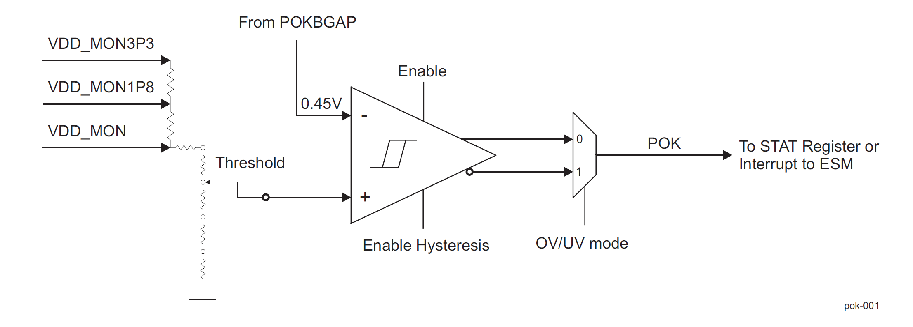
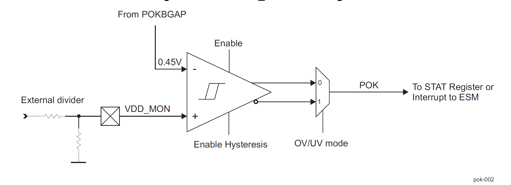
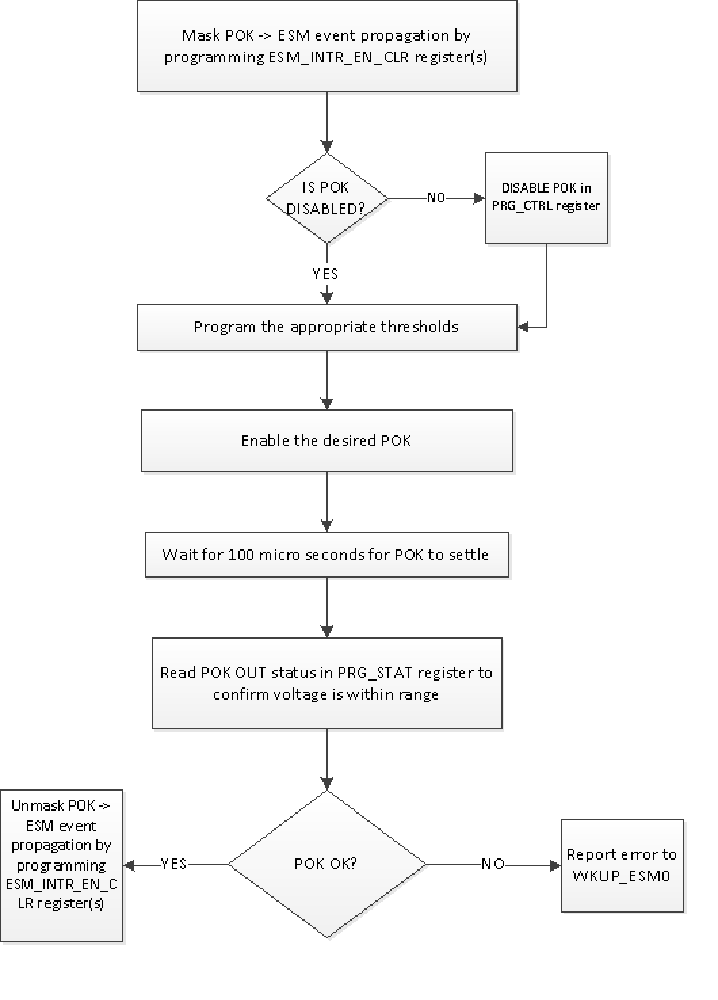
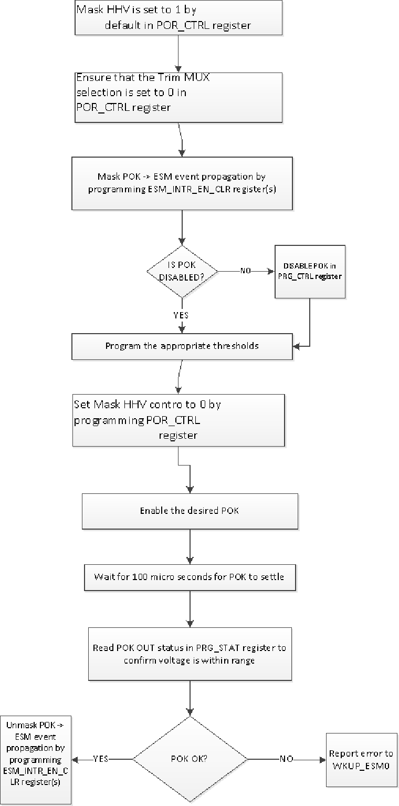
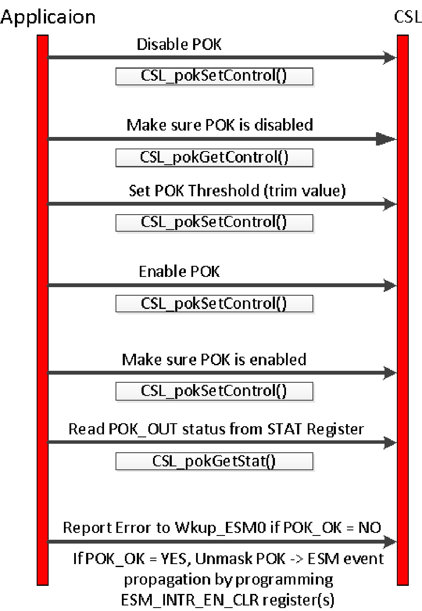

###############################################
Power OK and Power Reset Design Document
###############################################

.. raw:: latex

    \newpage
    
**Revision History**

=============== ============ =============== ================================ ========
Version         Date         Author          Change History                   Status
=============== ============ =============== ================================ ========
A               16-July-2020 Aravind  Batni  Initial Version                  Reviewed
--------------- ------------ --------------- -------------------------------- --------
B               04-Aug-2020  Aravind Batni   Review comments addressed        Released
--------------- ------------ --------------- -------------------------------- --------
C               18-Sept-2020 Aravind Batni   Fixed the dir structure
                                             table alignment                  Released
=============== ============ =============== ================================ ========

.. raw:: latex

    \newpage

************
Introduction
************

Overview
=========
This document provides the software design for the support of the Power OK (POK) and Power Reset (POR) modules in the Chip Support Library(CSL).

Purpose and Scope
=================
The purpose of this document is to define the software design for supporting POK/POR through CSL APIs.

This program is following the QRAS AP00216 SW Development Process for Functional Safety Quality.

Assumptions and Constraints
===========================
None

Relationship to Other Architecture Documents
============================================

CSL overall design is covered in the Chip_Support_Library_Design.pdf and is part of the Safety CSP release.

Stakeholders
===================

+----------------------+---------------------------------------------------------------------------------------+
| TI SW Developers     | SW developers can refer to this design for developing diagnostic SW for POK/POR       |
+----------------------+---------------------------------------------------------------------------------------+

Notational Conventions
======================

Notes
-----

***Note:***

None

Glossary
========

See `Directory`_.

References
==========

.. _[1]:

1. **J721E DRA829/TDA4VM/AM752x Processors, Silicon Revision 1.0**, Revision: Nov 2019 (SPRU1L1A, https://www.ti.com/lit/pdf/spruil1)

.. _[2]:

2. **DRA829/TDA4VM Safety Manual Jacinto™ 7 Processors**, Revision: Decemeber 2019, SPRUIR1_DRA829_TDA4VM_Safety_Manual_F3_draft.pdf.

.. _[3]:

3. **Chip Support Library Design document**, Revision C, May 2020, Chip_Support_Library_Design.pdf.

Features Not Supported
======================
N/A

******************
Design Description
******************

Functional/Logical Viewpoint
============================

Overview
---------
The Keystone3 SOCs incorporate "POK Modules" for monitoring voltages. POK (power ok) modules are responsible for accurately detecting voltage levels.
In general, POK modules are capable of monitoring a range of supplies and indicating a failure within the programmable upper and lower threshold limits for the supply being monitored. POKs are used to monitor 3.3 V, 1.8 V and core (0.6 V to 1.5 V) supply levels with programmable threshold levels. 
As an example, the POK programmable threshold resolution is 12.5mV for the threshold setting range from 0.475V to 1.35V for undervoltage protection.

POK modules are responsible for accurately detecting the voltage levels. Each module is trimmed to account for process and temperature variations. The trim values are provided by eFuse chains enabled by a POR/Reset Generator (PRG) module.

Hardware Details
----------------

Two types of POK modules are implemented in the Jacinto 7 family of devices - POK and POK_SA.

The POK has below over voltage and under voltage detection range values.

+--------------+-------------------------+------------------------+-----------------+
| POK          | Under Voltage Detection | Over Voltage Detection | Step Resolution |
+==============+=========================+========================+=================+
| CORE_POK     | 475mV - 1.35V           |  725mV - 1.65V         | 0.0125V         |
+--------------+-------------------------+------------------------+-----------------+
| POK1.8       | 1.432V - 2.168V         |  1.432V - 2.168V       | 0.02V           |
+--------------+-------------------------+------------------------+-----------------+
| POK3.3       | 2.625V - 3.975V         |  2.625V - 3.975V       | 0.0375V         |
+--------------+-------------------------+------------------------+-----------------+

The number of instances of each POK/POR may differ in an SOC.

For example, there are 12 POK instances and a single POK_SA instance (Total of 13 POK modules) in J721E.

J7200 has 9 instances of POK and 1 instance of POK_SA (Total of 10 POK modules).

Please refer to the TRM for more Hardware details on the POK/POR modules.

POK/POR Programming details
~~~~~~~~~~~~~~~~~~~~~~~~~~~
Each POK/POR module has inputs of "Enable Hysteresis" (HYST_EN from MMR), "Enable" (from PRG module), and "Threshold" (POK_TRIM from MMR).  The only POK instance that does not expose POK_TRIM (i.e. "Threshold") as a control is WKUP_POK0 for the VMON_ER_VSYS pin.

Each POK/POR module can write its outputs to sticky status registers in the PRG (i.e. CTRLMMR_WKUP_PRG0_STAT, CTRLMMR_WKUP_PRG1_STAT, and CTRLMMR_WKUP_MAIN_PRG_STAT), or route error events to the WKUP_ESM0

POK hardware block diagram and POK_SA hardware block diagrams are shown as below. These figures are taken from the Technical Reference manual of J721E, "SPRUIJ7A–May 2019–Revised November 2019" version. You can find them as Figure 5-1000 and Figure 5-1001 respectively for POK and POK_SA block diagram.

   :POK HW block diagram
   

   :POK_SA HW block diagram
   

Directory Structure
-------------------

The POK/POR CSL functional layer would be implemented with below directory structure.

::

    <csl>
     ├── csl_pok.h
     ├──src/ip/pok/
        ├── src_files_pok.mk
        └── V0
            ├── csl_pok.h
            └── priv
                ├── csl_pok.c
                
..

+-------------------------------------------------+-----------------------------------------------------+
| **File Name**                                   | **Description**                                     |
+=================================================+=====================================================+
|csl_pok.h                                        | Top level pok functional layer interface            |
|                                                 | include file                                        |
|-------------------------------------------------+-----------------------------------------------------+
|src/ip/pok/src_files_pok.mk                      | Makefile for POK/POR build                          |
+-------------------------------------------------+-----------------------------------------------------+
|src/ip/pok/V0/csl_pok.h                          | POK Function Layer - V0 version for J721e           |
+-------------------------------------------------+-----------------------------------------------------+
|src/ip/pok/V0/priv/csl_pok.c                     | POK Function Layer APIs - V0 version for J721e      |
+-------------------------------------------------+-----------------------------------------------------+

Component Interaction
---------------------
The Chip Support Library (CSL) POK/POR APIs provide access to program the SoC POK/POR configuration registers.

   :POK Application call flow diagram

The above flow diagram shows the application programming model for POK.

For the POKs in POR the programming model flow is as below.

   :POK in POR Application call flow diagram

Please refer to the TRM for POR functional description and POK/POR modules and various signal names.

..

Interfaces
----------
| Design Id: (did_csl_pok_interfaces)
| Requirement: REQ_TAG(PDK-5888) REQ_TAG(PDK-5890)

This section captures the interfaces designed to program the POK/POR registers. The API functions would validate the arguments for out-of-bound conditions and would also check for “NULL” pointers before programming the POK/POR registers

These APIs are written at design time and the final API may be different. See the Software API Guide for the released API.

To support the POK/POR, software needs to support the following functionality.

a) Ability to configure hysteresis 

b) Ability to program the voltage threshold for the comparator

c) APIs to readback written configuration registers

Please refer to the API definitions section for more details.

Process/Concurrency Viewpoint
=============================
POK/POR CSL APIs are independent, memoryless and stateless implementation. The CSL APIs are implemented as simple functions.
Any protection in terms of sharing between multiple tasks need to be taken care in the application.

Sequence Diagrams
-----------------
This section lists the sequence that can be followed. The APIs to achieve below sequence are listed under "API Section".

   : POK Sequence diagram

Resource Definitions
--------------------

By design the CSL POK/POR module is expected to have the following memory footprint.

=============== ======================
Parameter       Size
=============== ======================
Constant        0 bytes
--------------- ----------------------
Bss             < 100 bytes
--------------- ----------------------
Static          < 100 bytes
--------------- ----------------------
Data            < 100 bytes
--------------- ----------------------
Stack           < 100 bytes
--------------- ----------------------
Code            < 100 kbytes
=============== ======================

The execution of each API will be < 500 cycles.

Actual cycles, program, data memory requirements would be tabulated after the implementation is complete.

..

Interrupt Service Routines
--------------------------
The ISR routines are needed to be registered from higher layer to handle the POR/POR interrupts. This would be demonstrated as part of the POK/POR example code.

Error Handling
--------------
The CSL APIs check for NULL pointers and out of range arguments and return CSL_EBADARGS error code on these cases.

Context Viewpoint
=================
In general the POK/POR configuration for the POK/POR are done at init time. And when voltage thresholds are over or under, triggers an interrupt event in the ESM or is output seen in the POK/POR STAT register.

The Interrupt service routine registered with the interrupt event will be called and the application need to take action to respond to the event.

Use Case ID 1
-------------

+------------------------+-----------------------------------------------+
| Use Case ID            | UC-1                                          |
+========================+===============================================+
| Use Case               | Monitoring of Voltage threshold for POK/POR   |
+------------------------+-----------------------------------------------+
| Description            | To avoid any lockups in the POK any timeout   |
|                        | events need to be monitored on a continuous   |
|                        | basis                                         |
+------------------------+-----------------------------------------------+
| Actor(s)               |  - POK/POR Hardware module                    |
+------------------------+-----------------------------------------------+
| Trigger                |  Voltage threshold comparators                |
+------------------------+-----------------------------------------------+
| Primary Scenario       |  Voltage comparator check for failure         |
+------------------------+-----------------------------------------------+
| Alternative Scenario   |    N/A                                        |
+------------------------+-----------------------------------------------+
| Exceptional Scenario   |    N/A                                        |
+------------------------+-----------------------------------------------+
| Pre-Conditions         |  Normal operation with no errors in POK/POR   |
+------------------------+-----------------------------------------------+
| Post-Conditions        |  Take action to bring system to safe state    |
+------------------------+-----------------------------------------------+
| Assumptions            |  N/A                                          |
+------------------------+-----------------------------------------------+

************************************
Decision Analysis & Resolution (DAR)
************************************

Given the general design of stateless APIs, the CSL for POK/POR will follow the general architecture of CSL APIs. No specific design alternatives considered for POK/POR.

*****
Risks
*****

* None

***************
API Definitions
***************

Interfaces
==========
The interfaces for POK/POR are defined as below.

Please refer to POK/POR API doxygen details for below:

`POK/POR API doxygen <../../API-docs/csl/group___c_s_l___pok_por.html>`_ that describes the details on the POK/POR interface API.

..

Macros and Data Structures
---------------------------
The following Macros and Data structures are to be defined.

This enumerator defines the possible POK module types

::

    typedef  uint8_t                           CSL_pok_type;

        /** POK type Power System Module  */
    #define CSL_TYPE_POK                          ((uint8_t) 1U)
        /** POK_SA type Power System Module  */
    #define CSL_TYPE_POK_SA                       ((uint8_t) 2U)

..

This enumerator defines the possible hysteresis control values for the POK/POR modules
 
::

    typedef  uint8_t                           CSL_pwrss_hysteresis;

        /** Enable hysteresys for the module  */
    #define CSL_PWRSS_SET_HYSTERESIS_ENABLE             ((uint8_t) 1U)
        /** Disable hysteresys for the module  */
    #define CSL_PWRSS_SET_HYSTERESIS_DISABLE            ((uint8_t) 2U)
            /** Get hysteresys value for the module  */
    #define CSL_PWRSS_GET_HYSTERESIS_VALUE              ((uint8_t) 3U)
        /** No update on hysteresys for the module  */
    #define CSL_PWRSS_HYSTERESIS_NO_ACTION              ((uint8_t) 4U)

..

This enumerator defines the possible trim value for POK/POR modules. 
POK Trim bits 7 bits wide. Step size and range depends on which POK instance is used.
Any value between 0 through 127 is valid TRIM value. Please see below table.

::

    +------------+-----------------+------------------+-----------------+
    | POK        | Under Voltage   | Over Voltage     |                 |
    |            | Detection       | Detection        | Step Resolution |
    +============+=================+==================+=================+
    | CORE_POK   | 475mV - 1.35V   |  725mV - 1.65V   | 0.0125V         |
    +------------+-----------------+------------------+-----------------+
    | POK1.8     | 1.432V - 2.168V |  1.432V - 2.168V | 0.02V           |
    +------------+-----------------+------------------+-----------------+
    | POK3.3     | 2.625V - 3.975V |  2.625V - 3.975V | 0.0375V         |
    +------------+-----------------+------------------+-----------------+

..

::

    typedef  uint8_t                           CSL_pwrss_trim;
        /** TRIM is 7 bit value  */
    #define CSL_PWRSS_MIN_TRIM_VALUE               ((uint8_t) 0U)

        /** TRIM is 7 bit value, and hence the maximum value is 127  */
    #define CSL_PWRSS_MAX_TRIM_VALUE               ((uint8_t) 127U)

        /** No update on trim value read/write for the module  */
    #define CSL_PWRSS_TRIM_NO_ACTION               ((uint8_t) 128U)

            /** Command to get the trim value  */
    #define CSL_PWRSS_GET_TRIM_VALUE               ((uint8_t) 129U)

        /** Invalid TRIM value  */
    #define CSL_PWRSS_INVALID_TRIM_VALUE           ((uint8_t) 255U)

..

This enumerator defines the possible values of Voltage Detection modes

::

    typedef  uint8_t                           CSL_pwrss_vd_mode;

        /** Enable over voltage detection for the module  */
    #define CSL_PWRSS_SET_OVER_VOLTAGE_DET_ENABLE            ((uint8_t) 1U)
        /** Disable under voltage detection for the module   */
    #define CSL_PWRSS_SET_UNDER_VOLTAGE_DET_ENABLE           ((uint8_t) 2U)
            /** Get voltage detection for the module */
    #define CSL_PWRSS_GET_VOLTAGE_DET_MODE                   ((uint8_t) 3U)
        /** No update on voltage detection mode update for the module  */
    #define CSL_PWRSS_VOLTAGE_DET_NO_ACTION                  ((uint8_t) 4U)

..

This enumerator defines the POK Detection status values

::

    typedef uint8_t                             CSL_POK_detection_status;
    /** POK Detection Enabled */
    #define CSL_POK_DETECTION_ENABLED                ((uint8_t) 1U)
    /** POK Detection disabled */
    #define CSL_POK_DETECTION_DISABLED               ((uint8_t) 0U)

..

This enumerator defines the Voltage threshold status

::

    typedef uint8_t                             CSL_voltage_thr_status;
    /* POK Volage above threshold detected */
    #define CSL_VOLTAGE_ABOVE_THRESHOLD              ((uint8_t) 0U)
    /* POK Voltage normal/good */
    #define CSL_VOLTAGE_GOOD                         ((uint8_t) 1U)

..

This enumerator defines the trim selection values

::

    typedef uint8_t         CSL_por_trim_sel;

    /** Trim selections for Bandgap and POKs come from HHV defaults */
    #define  CSL_POR_TRIM_SELECTION_FROM_HHV_DEFAULT      ((uint8_t) 0U)

    /** Trim selections for Bandgap and POKs come from CTRLMMR_WKUP_POR_BANDGAP_CTRL and
        POR_POKxxx_CTRL registers */
    #define  CSL_POR_TRIM_SELECTION_FROM_CTRL_REGS        ((uint8_t) 1U)

..

This enumerator defines the override enable/set values

::

    typedef   uint8_t               CSL_por_override;

    /** PORHV OVERRIDE SET */
    #define   CSL_PORHV_OVERRIDE_SET_ENABLE                     ((uint8_t) 1U)

    /** PORHV OVERRIDE CLEAR */
    #define   CSL_PORHV_OVERRIDE_RESET_DISABLE                  ((uint8_t) 2U)

    /** BGOK OVERRIDE SET */
    #define   CSL_BGOK_OVERRIDE_SET_ENABLE                      ((uint8_t) 3U)

    /** BGOK OVERRIDE CLEAR */
    #define   CSL_BGOK_OVERRIDE_RESET_DISABLE                   ((uint8_t) 4U)

    /** POKHV OVERRIDE SET */
    #define   CSL_POKHV_OVERRIDE_SET_ENABLE                     ((uint8_t) 5U)

    /** POKHV OVERRIDE CLEAR */
    #define   CSL_POKHV_OVERRIDE_RESET_DISABLE                  ((uint8_t) 6U)

    /** POKLVA OVERRIDE SET */
    #define   CSL_POKLVA_OVERRIDE_SET_ENABLE                    ((uint8_t) 7U)

    /** POKLVA OVERRIDE CLEAR */
    #define   CSL_POKLVA_OVERRIDE_RESET_DISABLE                 ((uint8_t) 8U)

    /** POKLVB OVERRIDE SET */
    #define   CSL_POKLVB_OVERRIDE_SET_ENABLE                    ((uint8_t) 9U)

    /** POKLVB OVERRIDE CLEAR */
    #define   CSL_POKLVB_OVERRIDE_RESET_DISABLE                 ((uint8_t) 10U)

..

This enumerator defines the POR Module State

::

    typedef   uint8_t               CSL_por_module_status;

    /** POR in funcitonal mode */
    #define   CSL_POR_MODULE_STATUS_FUNCTIONAL_MODE             ((uint8_t) 0U)
    /** POR in Reset mode */
    #define   CSL_POR_MODULE_STATUS_RESET_MODE                  ((uint8_t) 1U)

..

This enumerator defines the Wake up control MMR register

::

    typedef CSL_wkup_ctrl_mmr_cfg0Regs CSL_wkupCtrlRegsBase_t;

..

This enumerator defines the possible POK module ID values on J721E

::

    typedef int8_t  CSL_pok_id;

    /** Invalid POK/POR ID */
    #define CSL_POK_VD_INVALID_ID                         (-1)
    /* PMIC POK ID */
    #define CSL_POK_VDDA_PMIC_IN_ID                       (0)
    /* CORE Under Voltage POK ID */
    #define CSL_POK_VDD_CORE_UV_ID                        (1)
    /* Wakeup General POK Under Voltage ID */
    #define CSL_POK_VDDSHV_WKUP_GEN_UV_ID                 (2)
    /* CPU under voltage POK ID */
    #define CSL_POK_VDD_CPU_UV_ID                         (3)
    /* MCU under voltage VDD POK ID */
    #define CSL_POK_VDDR_MCU_UV_ID                        (4)
    /* VMON under voltage POK ID */
    #define CSL_POK_VMON_EXT_UV_ID                        (5)
    /* MCU overvoltage POK ID */
    #define CSL_POK_VDD_MCU_OV_ID                         (6)
    /* VDD CORE POK ID */
    #define CSL_POK_VDDR_CORE_UV_ID                       (7)
    /* Wakeup General POK Over voltage ID */
    #define CSL_POK_VDDSHV_WKUP_GEN_OV_ID                 (8)
    /* CORE VDD Over Voltage POK ID */
    #define CSL_POK_VDD_CORE_OV_ID                        (9)
    /* MCU  over Voltage POK ID */
    #define CSL_POK_VDDR_MCU_OV_ID                        (10)
    /* CPU  over Voltage POK ID */
    #define CSL_POK_VDD_CPU_OV_ID                         (11)
    /* CORE VDDR over Voltage POK ID */
    #define CSL_POK_VDDR_CORE_OV_ID                       (12)
    /* VMON POK Over Voltage ID */
    #define CSL_POK_VMON_EXT_OV_ID                        (13)
    /* POKHV Under Voltage POK ID */
    #define CSL_POR_POKHV_UV_ID                           (14)
    /* POKLV Under Voltage POK ID */
    #define CSL_POR_POKLV_UV_ID                           (15)
    /* POKHV Over Voltage POK ID */
    #define CSL_POR_POKHV_OV_ID                           (16)
    /* POKLV Over Voltage POK ID */
    #define CSL_POR_POKLV_OV_ID                           (17)

..

.. tiapistruct:: CSL_pokCfg

.. tiapistruct:: CSL_pokPorStat

.. tiapistruct:: CSL_pokVal

.. tiapistruct:: CSL_pokPorCfg

.. tiapistruct:: CSL_pokPorVal

.. tiapistruct:: CSL_pokPorStat

Configure the POK/POR
-----------------------------

| Design Id: (did_csl_pok_cfg)
| Requirement: REQ_TAG(PDK-5888) REQ_TAG(PDK-5890)

The configuration for POK/POR includes the following API to set timeout, voltage threshold and hysteresis.

.. tiapifunc:: CSL_pokSetControl

.. tiapifunc:: CSL_pokGetControl

.. tiapifunc:: CSL_porGetStat

.. tiapifunc:: CSL_porSetControl

.. tiapifunc:: CSL_porGetControl

..

Test Plan
==========

POK/POR
-----------

Functional test
~~~~~~~~~~~~~~~~
POR/POK module needs to be programmed by software before it can be used for voltage monitoring functions.

Only when application needs, voltage monitoring functionality, software must program the voltage thresholds correctly before enabling the POR/POK interrupts/events for voltage error detection.

Below test would be done for POK. Note that one sample WKUP_POK instance would be selected for the test.

1) Mask POK event propagation by programming the PRG_CTRL register

2) Check if POK event is disabled

3) Programming the appropriate thresholds (and enable/disable hysteresis) settings in corresponding POK_CTRL register

4) Enable the desired POKs

5) Read the POK out status in PRG_STAT register to confirm that the voltage is within limits

6) Check if POK OK?

7a) Un-mask POK event propagation by programming the PRG_CTRL register

7b) Use ESM CSL to enable WKUP_ESM0 messages from POK

8) Declare the test PASS after receiving the POK event from ESM

Below test would be done for POK instances within POR. Note all the instances are not tested, one of the POK instance would be picked up for the test.

1) Mask HHV is set to 1 by default in POR_CTRL register

2) Ensure that the Trim MUX selection is set to 0 in POR_CTRL register

3) Check if POK event is disabled

4) Mask POK -> ESM event propagation by programming ESM_INTR_EN_CLR register(s)	

5) Programming the appropriate thresholds (and enable/disable hysteresis) settings in corresponding POK_CTRL register

6) Programming the Trim MUX selection to 1 in POR_CTRL register to select the new register/eFuse values.

7) Set Mask HHV contro to 0 by programming POR_CTRL register

8) Enable the desired POKs	

9) Read the POK out status in PRG_STAT register to confirm that the voltage is within limits

10) Check if POK OK

11a) Un-mask POK -> ESM event propagation by programming ESN_INTR_EN_SET register(s)

11b) Use ESM CSL to enable WKUP_ESM0 messages from POK

12) Declare the test PASS after receiving the POK event from ESM

Directory
=========

Index
-----
Index is not currently generated.

Glossary
--------

+---------------+-------------------------------------------------------------+
| **Term**      | **Definition**                                              |
+===============+=============================================================+
| SoC           | System-on-Chip, an integrated circuit that incorporates many|
|               | components into a single chip.                              |
+---------------+-------------------------------------------------------------+
| POK           | Power OK                                                    |
+---------------+-------------------------------------------------------------+
| POR           | Power on Reset                                              |
+---------------+-------------------------------------------------------------+
| CSL           | Chip Support Library                                        |
+---------------+-------------------------------------------------------------+

**Template Revision**

+---------------+----------------------+-----------------+--------------------------------------------------------------------------------------------------------------------------+
| **Version**   | **Date**             | **Author**      | **Description**                                                                                                          |
+===============+======================+=================+==========================================================================================================================+
| 0.01          | November 2017        | Jon Nafziger    | Initial version                                                                                                          |
+---------------+----------------------+-----------------+--------------------------------------------------------------------------------------------------------------------------+
| 0.02          | July 12, 2018        | Krishna Allam   | Updates to synchronize this SDD template with the methodology described in the Software Architecture document template   |
+---------------+----------------------+-----------------+--------------------------------------------------------------------------------------------------------------------------+
| 1.0           | September 19, 2018   | Frank Fruth     | Updates:                                                                                                                 |
|               |                      |                 |                                                                                                                          |
|               |                      |                 | -  Added a separate section/table for template revision (this table).                                                    |
|               |                      |                 |                                                                                                                          |
|               |                      |                 | -  Cleared revision history at start of document to be reserved for document revision                                    |
|               |                      |                 |                                                                                                                          |
|               |                      |                 | -  Minor cosmetic changes to title page, e.g., removed literature number reference;                                      |
+---------------+----------------------+-----------------+--------------------------------------------------------------------------------------------------------------------------+
| 1.0A          | November 19, 2018    | Sam Nelson      | Updates:                                                                                                                 |
|               |                      | Siluvaimani     |                                                                                                                          |
|               |                      |                 | -  Converted to RST format                                                                                               |
+---------------+----------------------+-----------------+--------------------------------------------------------------------------------------------------------------------------+
| 1.0B          | January 15, 2019     | Sam Nelson      | Updates:                                                                                                                 |
|               |                      | Siluvaimani     |                                                                                                                          |
|               |                      |                 | -  Some formatting changes and handling of references updated                                                            |
+---------------+----------------------+-----------------+--------------------------------------------------------------------------------------------------------------------------+
