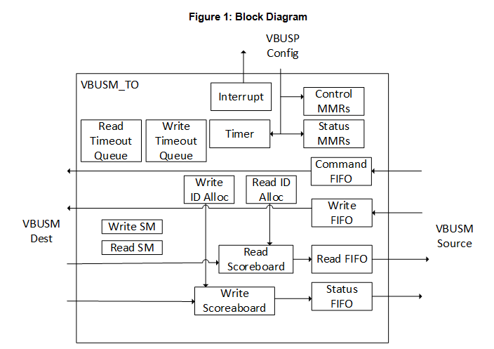
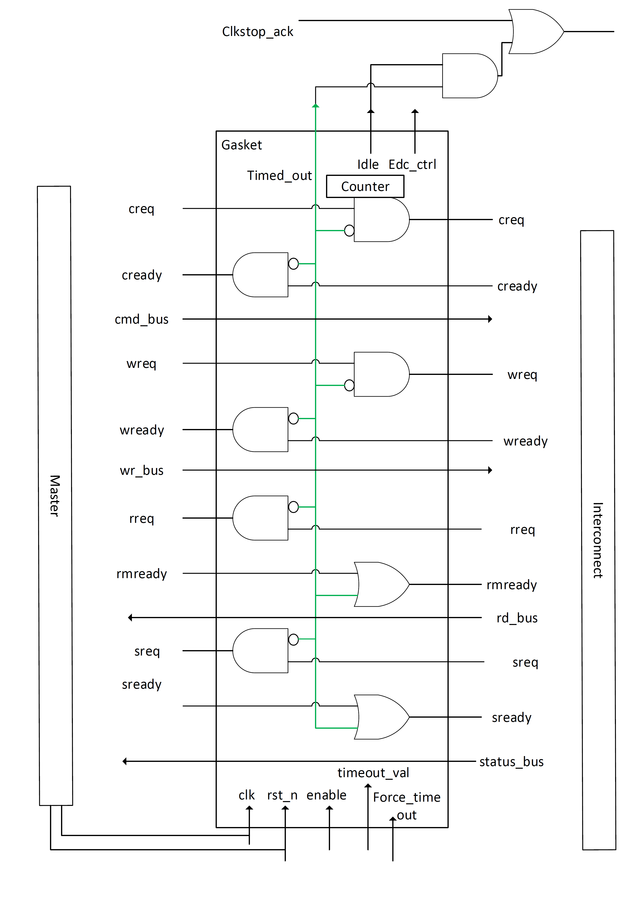
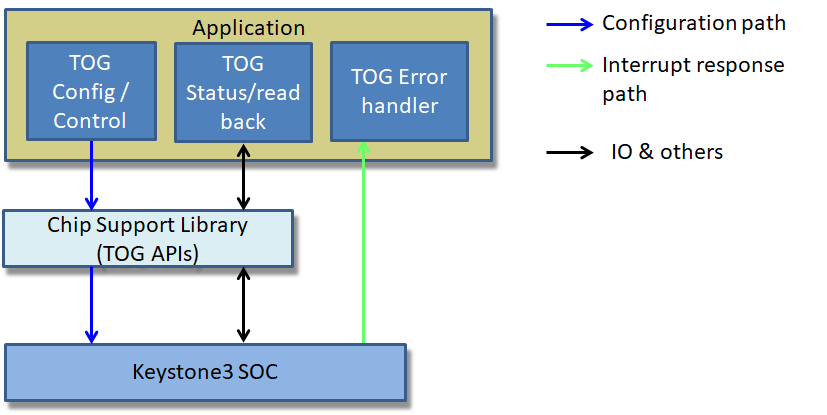
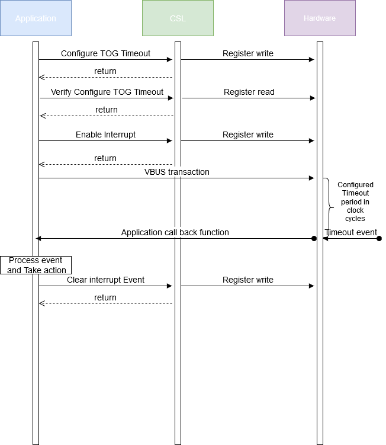

###############################################
Timeout Gasket Design Document
###############################################

.. raw:: latex

    \newpage
    
**Revision History**

=============== ============ =============== ================================ ========
Version         Date         Author          Change History                   Status
=============== ============ =============== ================================ ========
A               26-Jun-2020  Sam Nelson      Initial Version                  Released
                             Siluvaimani
=============== ============ =============== ================================ ========

.. raw:: latex

    \newpage

************
Introduction
************

Overview
=========
This document provides the software design for the support of the Timeout Gasket modules in the Chip Support Library(CSL).

Purpose and Scope
=================
The purpose of this document is to define the software design for supporting Timeout Gaskets through CSL APIs.

This program is following the QRAS AP00216 SW Development Process for Functional Safety Quality.

Assumptions and Constraints
===========================
None

Relationship to Other Architecture Documents
============================================

CSL overrall design is covered in the Chip_Support_Library_Design.pdf and is part of the Safety CSP release.

Stakeholders
===================

+----------------------+-----------------------------------------------------------------------------------+
| TI SW Developers     | SW developers can refer to this design for developing diagnostic SW for TOG       |
+----------------------+-----------------------------------------------------------------------------------+

Notational Conventions
======================

Notes
-----

***Note:***

None

Glossary
========

See `Directory`_.

References
==========

.. _[1]:

1. **J721E DRA829/TDA4VM/AM752x Processors, Silicon Revision 1.0**, Revision: Nov 2019 (SPRU1L1A, https://www.ti.com/lit/pdf/spruil1)

.. _[2]:

2. **DRA829/TDA4VM Safety Manual Jacinto™ 7 Processors**, Revision: Decemeber 2019, SPRUIR1_DRA829_TDA4VM_Safety_Manual_F3_draft.pdf.

.. _[3]:

3. **Chip Support Library Design document**, Revision C, May 2020, Chip_Support_Library_Design.pdf.

Features Not Supported
======================
N/A

******************
Design Description
******************

Functional/Logical Viewpoint
============================

Overview
---------
The Keystone3 SOCs incorporate a concept of MCU Island and incorporates use cases where the Safety critical software is running on the MCU island and non-safety critical software is running on the rest of the SOC. One of the main issues in these SOCs is non-safety critical software execution affecting the safety-critical software execution.  The overall target is to achieve Freedom from interference (FFI).

To acheive FFI, one concern is, non-safety critical software execution resulting in a VBUS error or the VBUS transaction does not complete for various reasons. This can result in a bus lockup and hang of the whole SOC and only can be recovered with a system reboot.  To avoid this a HW module called Timeout Gasket (TOG) helps in avoiding the lockup. 

These TOGs have the following functions, to avoid these concerns.

a) Monitors the various VBUS transactions and provides a way to detect any errors

b) Helps avoid the bus to be locked up due to a transaction in error.

CSL software will support APIs to configure the different Timeout Gaskets in the SOC and also will provide APIs to handle the errors.

Hardware Details
----------------

The following section describes the two types of timeout gaskets present in Keystone3 devices.

a) Slave TOG

b) Master TOG

The number of instances of each TOG may differ in an SOC.

For example, there are 4 Slave TOG instances in J721E.

J7VCL has 11 instances of Slave TOG and 20 instances of  Master TOG.

Note that these two Timeout Gaskets have a completely different design and register definitions.

Please refer to the TRM for more Hardware details on the Timeout Gasket modules.

Slave TOG
~~~~~~~~~~

The main aim of the Slave Timeout Gasket is to prevent any of the slave module access to lockup the bus in case of an incomplete or errored transaction.

The Slave safety timeout gasket is an IP that tracks outstanding transactions and allows for timeout/recovery.  An internal timer tracks the amount of time a transaction has been outstanding and will time-out if the time exceeds a programmable threshold.  In the event of a timeout, the timeout gasket will log information regarding the transaction into memory-mapped registers and trigger an interrupt.  The timeout gasket will also provide a response back to the master endpoint to allow for recovery of the interconnect.

In addition to a timer counter, the hardware module has a register that captures the eon count. ( eon count increments every time the timer count equals to the configured timeout value).

See the block diagram of the Slave Timeout Gasket here.

   :Slave TOG HW block diagram
   
   

Note the slave TOG does not support a way to force a timeout. But the timeout can be triggered by programming the timeout to the lowest possible timeout value.

Master TOG
~~~~~~~~~~~
(Only on J7VCL and later devices.)

In J7VCL, a concept of extended MCU island is introduced, which includes hardware modules which are part of the main domain as well as to be accessing shared slave resources with the MCU master.

The Master TOG is now added to avoid any of the extended island masters to lockup the slave modules.

   :Master TOG HW block diagram
   
   Note the Master TOG supports a way to force a timeout by writing a bit in the TOG Control register.

General TOG details
~~~~~~~~~~~~~~~~~~~~

Each of the Timeout gaskets can be programmed to a specific timeout and any transaction exceeding the timeout will result in abort of the transaction. This will also result in an error event triggered through ESM, which will in turn can be programmed to interrupt the CPU.

In addition the timeout gasket can be stopped, started and reset at anytime.

To support configuration and control of the Timeout Gasket, TOG CSL functional layer APIs would be added.
The APIs will also support read back of written registers and static registers.

APIs are tested using a CSL example applications.

Directory Structure
-------------------

The TOG CSL functional layer would be implemented with below directory structure.

::

    <csl>
     ├── cslr_tog.h
     ├── csl_tog.h
     ├──src/ip/tog/
        ├── src_files_tog.mk
        └── V0
            ├── csl_mst_tog.h
            ├── cslr_ksbus_vbusm_to_gasket.h
            ├── csl_slv_tog.h
            └── priv
                ├── csl_mst_tog.c
                └── csl_slv_tog.c

..

+-------------------------------------------------+-----------------------------------------------------+
| **File Name**                                   | **Description**                                     |
+=================================================+=====================================================+
|cslr_tog.h                                       | Top level TOG register layer interface file         |
+-------------------------------------------------+-----------------------------------------------------+
|csl_tog.h                                        | Top level TOG API interface include h file          |
+-------------------------------------------------+-----------------------------------------------------+
|src/ip/tog/src_files_tog.mk                      | Makefile for TOG build                              |
+-------------------------------------------------+-----------------------------------------------------+
|src/ip/tog/V0/cslr_ksbus_vbusm_to_gasket.h       | STOG Register Layer - V0 version for J721e          |
+-------------------------------------------------+-----------------------------------------------------+
|src/ip/tog/V0/csl_slv_tog.h                      | STOG Function Layer - V0 version for J721e          |
+-------------------------------------------------+-----------------------------------------------------+
|src/ip/tog/V0/csl_mst_tog.h                      | MTOG Function Layer - V0 version for J721e          |
+-------------------------------------------------+-----------------------------------------------------+
|src/ip/tog/V0/priv/csl_slv_tog.c                 | STOG Function Layer APIs - V0 version for J721e     |
+-------------------------------------------------+-----------------------------------------------------+
|src/ip/tog/V0/priv/csl_mst_tog.c                 | MTOG Function Layer APIs - V0 version for J721e     |
+-------------------------------------------------+-----------------------------------------------------+

Component Interaction
---------------------
The Chip Support Library (CSL) TOG APIs provide access to program the SoC TOG configuration registers.

   :TOG Application call flow diagram

The application will configure the timeout and start the timeout gasket at init time. Application can call CSL TOG APIs to read back written configuration, readback static configuration registers and read other status registers.
During run time any timout event happening will result in the interrupt handler getting called. The interrupt handler in the application will in turn handle the error and bring system to safe state.

..

Interfaces
----------
| Design Id: (did_csl_tog_interfaces)
| Requirement: REQ_TAG(PDK-5885) REQ_TAG(PDK-5887) REQ_TAG(PDK-5889) REQ_TAG(PDK-5891) REQ_TAG(PDK-5892) REQ_TAG(PDK-5894)

This section captures the interfaces designed to program the TOG registers. The API functions would validate the arguments for out-of-bound conditions and would also check for “NULL” pointers before programming the TOG registers

These APIs are written at design time and the final API may be different. See the Software API Guide for the released API.

To support the TOG, software needs to support the following functionality.

a) Ability to configure Timeout Gasket

b) Ability to start, stop and reset the Timeout Gasket

c) APIs to readback written configuration registers

d) Need APIs to read error and status registers

e) Ability to force timeout and flush transaction on the Timeout Gasket

f) Ability to enable/disable/check/clear interrupt events

Please refer to the API definitions section for more details.

Process/Concurrency Viewpoint
=============================
TOG CSL APIs are independent, memoryless and stateless implementation. The CSL APIs are implemented as simple functions.
Any protection in terms of sharing between multiple tasks need to be taken care in the application.

Sequence Diagrams
-----------------
This section lists the sequence that can be followed. The APIs to achieve below sequence are listed under "API Section".

   : TOG Sequence diagram

Resource Definitions
--------------------

By design the CSL TOG module is expected to have the following memory footprint.

=============== ======================
Parameter       Size
=============== ======================
Constant        0 bytes
--------------- ----------------------
Bss             ~20 kbytes (expected)
--------------- ----------------------
Static          < 100 bytes
--------------- ----------------------
Data            < 100 bytes
--------------- ----------------------
Stack           < 100 bytes
--------------- ----------------------
Code            < 100 kbytes
=============== ======================

The execution of each API will be < 500 cycles.

Actual cycles, program, data memory requirements would be tabulated after the implementation is complete.

..

Interrupt Service Routines
--------------------------
The ISR routines are needed to be registered from higher layer to handle the TOG interrupts. This would be demonstrated as part of the TOG example code.

Error Handling
--------------
The CSL APIs check for NULL pointers and out of range arguments and return CSL_EBADARGS error code on these cases.

Context Viewpoint
=================
In general the timeout configuration for the Gaskets are done at init time. And when any transaction associated with a gasket times out, this triggers an interrupt event in the ESM.

The Interrupt service routine registered with the interrupt event will be called and the application need to take action to respond to the event.

Use Case ID 1
-------------

+------------------------+-----------------------------------------------+
| Use Case ID            | UC-1                                          |
+========================+===============================================+
| Use Case               | Monitoring of Timeout for Slave TOG           |
+------------------------+-----------------------------------------------+
| Description            | To avoid any lockups in the BUS any timeout   |
|                        | events need to be monitored on a continuous   |
|                        | basis                                         |
+------------------------+-----------------------------------------------+
| Actor(s)               |  - Slave Timeout Hardware module              |
|                        |  - Any errored slave transaction              |
+------------------------+-----------------------------------------------+
| Trigger                |  Errored slave transaction                    |
+------------------------+-----------------------------------------------+
| Primary Scenario       |  Errored transaction in bus leading to failure|
+------------------------+-----------------------------------------------+
| Alternative Scenario   |    N/A                                        |
+------------------------+-----------------------------------------------+
| Exceptional Scenario   |    N/A                                        |
+------------------------+-----------------------------------------------+
| Pre-Conditions         |  Normal operation with no errors in bus       |
+------------------------+-----------------------------------------------+
| Post-Conditions        |  Take action to bring system to safe state    |
+------------------------+-----------------------------------------------+
| Assumptions            |  N/A                                          |
+------------------------+-----------------------------------------------+

Use Case ID 2
-------------

+------------------------+-----------------------------------------------+
| Use Case ID            | UC-2                                          |
+========================+===============================================+
| Use Case               | Monitoring of Timeout for Master TOG          |
+------------------------+-----------------------------------------------+
| Description            | To avoid any lockups in the BUS any timeout   |
|                        | events need to be monitored on a continuous   |
|                        | basis                                         |
+------------------------+-----------------------------------------------+
| Actor(s)               |  - Master Timeout Hardware module             |
|                        |  - Any errored master transaction             |
+------------------------+-----------------------------------------------+
| Trigger                |  Errored master transaction                   |
+------------------------+-----------------------------------------------+
| Primary Scenario       |  Errored transaction in bus leading to failure|
+------------------------+-----------------------------------------------+
| Alternative Scenario   |    N/A                                        |
+------------------------+-----------------------------------------------+
| Exceptional Scenario   |    N/A                                        |
+------------------------+-----------------------------------------------+
| Pre-Conditions         |  Normal operation with no errors in bus       |
+------------------------+-----------------------------------------------+
| Post-Conditions        |  Take action to bring system to safe state    |
+------------------------+-----------------------------------------------+
| Assumptions            |  N/A                                          |
+------------------------+-----------------------------------------------+

************************************
Decision Analysis & Resolution (DAR)
************************************

Given the general design of stateless APIs, the CSL for TOG will follow the general architecture of CSL APIs. No specific design alternatives considered for TOG.

*****
Risks
*****

* None

***************
API Definitions
***************

Interfaces
==========
The interfaces for TOG are defined as below.

Please refer to TOG API doxygen details for below:

`TOG API doxygen <../../API-docs/csl/group___c_s_l___tog.html>`_ that describes the details on the TOG interface API.

..

Macros and Data Structures
---------------------------
The following Macros and Data structures are to be defined.

For the slave TOG.

::

    typedef uint32_t CSL_SlvTogIntrSrc;
        /** Transaction timeout */
    #define CSL_SLV_TOG_INTRSRC_TRANSACTION_TIMEOUT ((uint32_t) 1U<<0)
        /** Unexpected response */
    #define CSL_SLV_TOG_INTRSRC_UNEXPECTED_RESPONSE ((uint32_t) 1U<<1)
        /** Command timeout */
    #define CSL_SLV_TOG_INTRSRC_COMMAND_TIMEOUT     ((uint32_t) 1U<<2)
        /** All interrupt sources */
    #define CSL_SLV_TOG_INTRSRC_ALL                 (CSL_SLV_TOG_INTRSRC_TRANSACTION_TIMEOUT | CSL_SLV_TOG_INTRSRC_UNEXPECTED_RESPONSE | CSL_SLV_TOG_INTRSRC_COMMAND_TIMEOUT)

..

.. .. tiapistruct:: CSL_SlvTogErrInfo

::

    typedef struct
    {
        /** Route ID - This indicates the Route ID of the captured transaction */
        uint32_t    routeId;
        /** Order ID - This indicates the Order ID of the captured transaction */
        uint32_t    orderId;
        /** Direction - This indicates whether the captured transaction was a read (1) or a write (0) */
        uint32_t    dir;
        /** Type - This indicates the error type: 0=Transaction Timeout, 1=Unexpected Response */
        uint32_t    type;
        /** Tag - This indicates the Command ID/ Router ID/Status ID (CID/RID/SID) of the transaction */
        uint32_t    tag;
        /** Command ID - This indicates the original Command ID (Status ID(SID)/Router ID (RID)) of the command.
            This field is only valid on a Timeout Error, not on an Unexpected Transaction Error */
        uint32_t    commandId;
        /** Original Byte Count - If this is a timed out transaction, then this field
            represents the CBYTECNT value of the original command.  If this is an
            unexpected response transaction, then this field contains the value of
            the bytecnt of the unexpected transaction (sbytecnt or rbytecnt). */
        uint32_t    orgByteCnt;
        /** Current Byte Count - If this is a timed out transaction, this is the number of
            bytes that were not returned as of the time the transaction timed out.  If this
            is an unexpected response transaction, then this field is not applicable. */
        uint32_t    currByteCnt;
        /** Address - If the captured transaction was a Timeout Error, this field represents
            the address of the original transaction. If the error was an Unexpected Response
            error, then this field is not applicable. */
        uint64_t    address;
    } CSL_SlvTogErrInfo;

..

.. tiapistruct:: CSL_SlvTog_staticRegs

..

.. For the master TOG:

::

..    typedef uint32_t CSL_MstTogVal;
..        /** 1024 clock cycles */
..    #define CSL_MST_TOG_VAL_1K          ((uint32_t) 0U)
..        /** 4096 clock cycles */
..    #define CSL_MST_TOG_VAL_4K          ((uint32_t) 1U)
..        /** 16,384 clock cycles */
..    #define CSL_MST_TOG_VAL_16K         ((uint32_t) 2U)
..        /** 65,536 clock cycles */
..    #define CSL_MST_TOG_VAL_64K         ((uint32_t) 3U)
..        /** 262,144 clock cycles */
..    #define CSL_MST_TOG_VAL_256K        ((uint32_t) 4U)
..        /** 1,048,576 clock cycles */
..    #define CSL_MST_TOG_VAL_1M          ((uint32_t) 5U)
..        /** 2,097,152 clock cycles */
..    #define CSL_MST_TOG_VAL_2M          ((uint32_t) 6U)
..        /** 4,194,303 clock cycles */
..    #define CSL_MST_TOG_VAL_4M_MINUS_1  ((uint32_t) 7U)

..

.. .. tiapistruct:: CSL_MstTog_staticRegs

Configure the Slave TOG
-----------------------------

| Design Id: (did_csl_stog_cfg)
| Requirement: REQ_TAG(PDK-5894)

The configuration for slave TOG includes the following API to set timeout, interrupt enable and Flush mode enable.

.. tiapifunc:: CSL_slvTogSetTimeoutVal
.. tiapifunc:: CSL_slvTogSetIntrEnable
.. tiapifunc:: CSL_slvTogSetFlushModeEnable

..

.. Configure the Master TOG
.. -----------------------------

.. The configuration for master TOG includes the following API to set timeout.

.. .. tiapifunc:: CSL_mstTogSetTimeoutVal

Control the Slave TOG
------------------------

| Design Id: (did_csl_stog_control)
| Requirement: REQ_TAG(PDK-5894)

The control APIs of the slave TOG include start, stop and reset of timeout Gasket.

.. tiapifunc:: CSL_slvTogStart
.. tiapifunc:: CSL_slvTogStop
.. tiapifunc:: CSL_slvTogReset

..

.. Control the Master TOG
.. ------------------------

.. The control APIs of the slave TOG include start, stop and reset of timeout Gasket.

.. .. tiapifunc:: CSL_mstTogStart
.. .. tiapifunc:: CSL_mstTogStop
.. .. tiapifunc:: CSL_mstTogReset

..

Get error and status information
---------------------------------

| Design Id: (did_csl_stog_get_error_information)
| Requirement: REQ_TAG(PDK-5885) REQ_TAG(PDK-5889)

.. tiapifunc:: CSL_slvTogGetErrInfo
.. tiapifunc:: CSL_slvTogGetIntrPending
.. tiapifunc:: CSL_slvTogGetRawIntrPending
.. tiapifunc:: CSL_slvTogClrIntrPending
.. tiapifunc:: CSL_slvTogGetIntrCount
.. tiapifunc:: CSL_slvTogAckIntr

.. tiapifunc:: CSL_slvTogGetStatus
.. tiapifunc:: CSL_slvTogGetCurrTimerCnt
.. tiapifunc:: CSL_slvTogGetRevision
.. tiapifunc:: CSL_slvTogGetCfg

..

Error Injection for Slave TOG
------------------------------

| Design Id: (did_csl_stog_error_injection)
| Requirement: REQ_TAG(PDK-5887)

.. tiapifunc:: CSL_slvTogSetIntrPending

..

.. Error Injection for Master TOG
.. ------------------------------

.. .. tiapifunc:: CSL_mstTogForceTimeout

..

Read back of written registers
-------------------------------

| Design Id: (did_csl_stog_wr_read_back)
| Requirement: REQ_TAG(PDK-5891)

The way the read back of written configuration is acheived by calling the corresponding "Verify" for each of the configuration APIs.
For example CSL_slvTogVerifyTimeoutVal reads back and verifies the configuration written by CSL_slvTogSetTimeoutVal API.

.. tiapifunc:: CSL_slvTogVerifyTimeoutVal
.. tiapifunc:: CSL_slvTogVerifyIntrEnable
.. tiapifunc:: CSL_slvTogVerifyFlushModeEnable

For the master configuration, CSL_mstTogVerifyTimeoutVal reads back and verifies the configuration written by CSL_mstTogSetTimeoutVal API.

.. tiapifunc:: CSL_mstTogVerifyTimeoutVal

..

Read back of static configuration registers
--------------------------------------------

| Design Id: (did_csl_tog_static_read_back)
| Requirement: REQ_TAG(PDK-5891)

.. tiapifunc:: CSL_slvTogReadBackStaticRegisters
.. .. tiapifunc:: CSL_mstTogReadBackStaticRegisters

..

Test Plan
==========

Slave TOG
---------

Functional test
~~~~~~~~~~~~~~~~

There are multiple instances of Slave TOG in the SOC. Each instance needs to be covered by testing.

Test Sequence

The following sequence will be used to test the Slave TOG.

a) Register interrupt handler to handle ESM Event associated with the Slave TOG

b) Configure Timeout

c) Enable ESM event/Interrupt

d) Start TOG

e) Call APIs to force the timeout. 

   Note: As there is no way to force a timeout, the approach to emulate the timeout is by programming the lowest timeout value, so that every transaction will fail.
   Note this has a risk that if in real SOC, a particular transaction will not timeout even with lowest timeout, then the force of the timeout cannot emulated.

f) Wait for  ESM event to be reported.

g) If event occurs, ISR services interrupt, read error information and clears interrupt.

h) If event reported successfully, print error information.

i) Pass if ESM event occurred. Fail if timed out.

J721E
^^^^^^

Specific to the J721E platform there are 3 instances of Slave TOG associated with the MCU and one associated with WKUP domain.

Here are the corresponding base address defines:

CSL_MCU_TIMEOUT_64B2_CFG_BASE

CSL_MCU_TIMEOUT_INFRA0_CFG_BASE

CSL_MCU_TIMEOUT_FW1_CFG_BASE

CSL_WKUP_TIMEOUT_INFRA0_CFG_BASE

The corresponding ESM events are

CSLR_MCU_ESM0_ESM_LVL_EVENT_MCU_TIMEOUT_64B2_TRANS_ERR_LVL_0        

CSLR_MCU_ESM0_ESM_LVL_EVENT_MCU_TIMEOUT_INFRA0_SAFEG_TRANS_ERR_LVL_0

CSLR_MCU_ESM0_ESM_LVL_EVENT_MCU_TIMEOUT_FW1_SAFEG_TRANS_ERR_LVL_0

CSLR_WKUP_ESM0_ESM_LVL_EVENT_WKUP_TIMEOUT_INFRA0_SAFEG_TRANS_ERR_LVL_0

Master TOG
-----------

Functional test
~~~~~~~~~~~~~~~~

The following sequence will be used to test the Master TOG.

a) Register interrupt handler to handle ESM Event associated with the Master TOG

b) Configure Timeout

c) Enable ESM event/Interrupt

d) Start TOG

e) Call API to force the timeout.

f) Wait for  ESM event to be reported.

g) If event occurs, ISR services ESM interrupt.

h) Pass if ESM event occurred. Fail if timed out.

(Note Master TOG does not register the cause of the Timeout)

Directory
=========

Index
-----
Index is not currently generated.

Glossary
--------

+---------------+-------------------------------------------------------------+
| **Term**      | **Definition**                                              |
+===============+=============================================================+
| SoC           | System-on-Chip, an integrated circuit that incorporates many|
|               | components into a single chip.                              |
+---------------+-------------------------------------------------------------+
| TOG           | Timeout Gasket                                              |
+---------------+-------------------------------------------------------------+
| STOG          | Slave Timeout Gasket                                        |
+---------------+-------------------------------------------------------------+
| MTOG          | Master Timeout Gasket                                       |
+---------------+-------------------------------------------------------------+
| CSL           | Chip Support Library                                        |
+---------------+-------------------------------------------------------------+

**Template Revision**

+---------------+----------------------+-----------------+--------------------------------------------------------------------------------------------------------------------------+
| **Version**   | **Date**             | **Author**      | **Description**                                                                                                          |
+===============+======================+=================+==========================================================================================================================+
| 0.01          | November 2017        | Jon Nafziger    | Initial version                                                                                                          |
+---------------+----------------------+-----------------+--------------------------------------------------------------------------------------------------------------------------+
| 0.02          | July 12, 2018        | Krishna Allam   | Updates to synchronize this SDD template with the methodology described in the Software Architecture document template   |
+---------------+----------------------+-----------------+--------------------------------------------------------------------------------------------------------------------------+
| 1.0           | September 19, 2018   | Frank Fruth     | Updates:                                                                                                                 |
|               |                      |                 |                                                                                                                          |
|               |                      |                 | -  Added a separate section/table for template revision (this table).                                                    |
|               |                      |                 |                                                                                                                          |
|               |                      |                 | -  Cleared revision history at start of document to be reserved for document revision                                    |
|               |                      |                 |                                                                                                                          |
|               |                      |                 | -  Minor cosmetic changes to title page, e.g., removed literature number reference;                                      |
+---------------+----------------------+-----------------+--------------------------------------------------------------------------------------------------------------------------+
| 1.0A          | November 19, 2018    | Sam Nelson      | Updates:                                                                                                                 |
|               |                      | Siluvaimani     |                                                                                                                          |
|               |                      |                 | -  Converted to RST format                                                                                               |
+---------------+----------------------+-----------------+--------------------------------------------------------------------------------------------------------------------------+
| 1.0B          | January 15, 2019     | Sam Nelson      | Updates:                                                                                                                 |
|               |                      | Siluvaimani     |                                                                                                                          |
|               |                      |                 | -  Some formatting changes and handling of references updated                                                            |
+---------------+----------------------+-----------------+--------------------------------------------------------------------------------------------------------------------------+
