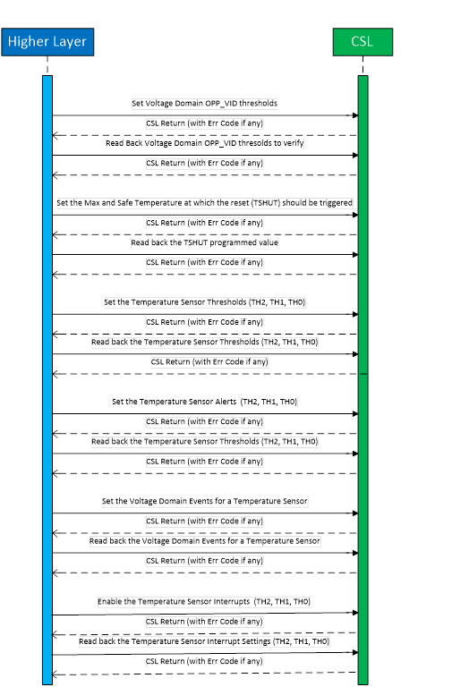
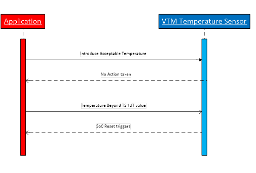
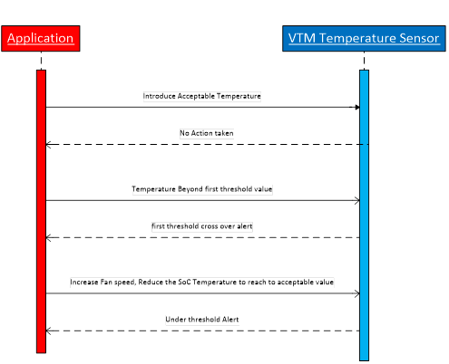

###############################################
Voltage and Thermal management Design Document
###############################################

.. raw:: latex

    \newpage
    
**Revision History**

=============== ============ =============== ================================ ========
Version         Date         Author          Change History                   Status
=============== ============ =============== ================================ ========
A               10-Mar-2020  Aravind Batni   Initial Version                  Released
--------------- ------------ --------------- -------------------------------- --------
B               12-Mar-2020  Aravind Batni   Addressed review inputs          Released
--------------- ------------ --------------- -------------------------------- --------
C               01-Jul-2020  Aravind Batni   Added Req Tag                    Released
=============== ============ =============== ================================ ========

.. raw:: latex

    \newpage

************
Introduction
************
VTM implements the MMR reading of temperature as well as interrupt/alert information for thermal management.

Functional Overview
===================

This document will provide an overview of the software design of the Voltage and Thermal Management (VTM) IP.

The VTM controls the temperature monitors in the die. The VTM can enable the sensors periodically to keep the reported data continually updated. Also the temperature value coming back from the monitor is captured and reported by the VTM MMRs. The VTM will keep the sensors in reset state when not enabled to save power and reduce sensor usage to maximize the sensor life.

Purpose and Scope
=================
The purpose of this document is to define the software design for Voltage and Thermal Manager (VTM) for Keystone III System on Chip families.
This program is following the QSS 024-000+ Quality Managed Software Flow for Embedded Processing. 

Assumptions and Constraints
===========================
None

Relationship to Other Architecture Documents
============================================

The VTM can include safety when the safe parameter is set (example SoC where safe paramerter is set is J721e). When set, the MMRs will include parity protection, the VBUSP port will include safety protection, and some internal flops will be parity protected, and a safety controller and ECC Aggregator will be included in the VTM.
Please refer to CSL ECC Aggregator APIs for programming the VTM ECC Aggregators.

Stakeholders
===================

+----------------------+-----------------------------------------------------------------------------------+
| TI SW Developers     | SW developers can refer to this design for developing diagnostic SW for VTM       |
+----------------------+-----------------------------------------------------------------------------------+

Notational Conventions
======================

Notes
-----

***Note:***

None

Glossary
========

See Directory.

Features Not Supported
======================
N/A

******************
Design Description
******************

Functional/Logical Viewpoint
============================

Overview
---------
The VTM CSL functional layer APIs is designed to configure thermal warning registers for a given temperature sensor in designated voltage domains, as well as read back of written registers and static registers.

To configure the VTM ECC aggregator registers, ECC aggregator CSL functional layer APIs are invoked.
The VTM Chip Support Library APIs are designed to provide APIs to configure the Voltage and Temperature Sensors of the IP.
APIs are tested using a CSL example applications.

Directory Structure
-------------------

The VTM CSL functional layer implementation would be implemented with below directory structure.

::

    <csl>
     ├── cslr_vtm.h
     ├── csl_vtm.h
     ├──src/ip/vtm/
        ├── src_files_vtm.mk
        ├── V0
        │   └── cslr_vtm.h
        └── V1
            ├── csl_pvt_sensor_lut.h
            ├── cslr_vtm.h
            ├── csl_vtm.h
            ├── csl_vtm_pvt_sensor.h
            └── priv
                ├── csl_vtm.c
                └── csl_vtm_pvt_sensor.c

..

+-------------------------------+-----------------------------------------------------+
| **File Name**                 | **Description**                                     |
+===============================+=====================================================+
|cslr_vtm.h                     | Top level VTM register layer interface file         |
+-------------------------------+-----------------------------------------------------+
|csl_vtm.h                      | Top level VTM API interface include h file          |
+-------------------------------+-----------------------------------------------------+
|src/ip/vtm/src_files_vtm.h     | Makefile for VTM build                              |
+-------------------------------+-----------------------------------------------------+
|src/ip/vtm/V1/cslr_vtm.h       | VTM Register Layer - V1 version for J721e           |
+-------------------------------+-----------------------------------------------------+
|src/ip/vtm/V1/csl_vtm.h        | VTM Function Layer - V1 version for J721e           |
+-------------------------------+-----------------------------------------------------+
|src/ip/vtm /V1/priv/csl_vtm.c  | VTM Function Layer APIs - V1 version for J721e      |
+-------------------------------+-----------------------------------------------------+

Component Interaction
---------------------
The Chip Support Library (CSL) VTM APIs provide access to program the SoC VTM configuration registers.

.. figure:: vtm_design_diagrams/CSL_VTM_Interaction_diagram.png
   :width: 80%
   :align: center

   :VTM System interaction diagram

..

Interfaces
----------
| Design Id: (did_csl_vtm_interfaces)
| Requirement: REQ_TAG(PDK-5862) REQ_TAG(PDK-5863) REQ_TAG(PDK-5865) REQ_TAG(PDK-5866)

The interfaces that are designed to program the VTM registers would validate the arguments for out-of-bound conditions and would also check for “NULL” pointers before programming the VTM registers

These APIs are written at design time and the final API may be different. See the Software API Guide for the released API.

Below Interfaces would be provided.

#. Configure the voltage domain
#. Configure the temperature warning
#. Read back of written registers
#. Read back of static configuration registers

Please refer to the API definitions section.

Process/Concurrency Viewpoint
=============================
VTM CSL APIs are independent, memoryless and stateless implementation. The CSL APIs are implemented for a single task, single thread use cases.

Sequence Diagrams
-----------------
This section lists the sequence that can be followed. The APIs to achieve below sequence are listed under "API Section".

   : VTM Sequence diagram

Resource Definitions
--------------------
The design has below footprints.

=============== ======================
Parameter       Size
=============== ======================
Constant        0 bytes
--------------- ----------------------
Bss             ~20 kbytes (expected)
--------------- ----------------------
Static          < 100 bytes
--------------- ----------------------
Data            < 100 bytes
--------------- ----------------------
Stack           < 100 bytes
--------------- ----------------------
Code            < 100 kbytes
=============== ======================

    Actual cycles, program, data memory requirements would be tabulated after the implementation is complete.

..

Interrupt Service Routines
--------------------------
The ISR routines are needed to be registered from higher layer to handle the VTM interrupts. This would be demonstrated as part of the VTM example code.

Error Handling
--------------
The CSL APIs check for NULL pointers and out of range arguments and return CSL_EBADARGS error code on these cases.

Context Viewpoint
=================
There are 3 different alerts VTM can output to system to take necessary actions. 

#. Alert for temperature when it is below a programmed value
#. Alert for temperature increased above a programmed value  (first threshold)
#. Alert for temperature is beyond the first threshold and still raising to go beyond a programmed value (second threshold).

VTM can initiate SOC reset if temperature keeps rising and reaches a max threshold beyond the second threshold.

Use Case ID 1
-------------

+------------------------+-----------------------------------------------+
| Use Case ID            | UC-1                                          |
+========================+===============================================+
| Use Case               | VTM SOC RESET _ Thermal Shutdown              |
+------------------------+-----------------------------------------------+
| Description            | SoC Reset after Max temperature is reached.   |
+------------------------+-----------------------------------------------+
| Actor(s)               |  - TSHUT VTM registers.                       |
|                        |  - External Temperature                       |
|                        |  - Junction Temperature monitor               |
+------------------------+-----------------------------------------------+
| Trigger                |  - External Temperature                       |
+------------------------+-----------------------------------------------+
| Primary Scenario       |  - Continuously raising Temperature           |
+------------------------+-----------------------------------------------+
| Alternative Scenario   |    N/A                                        |
+------------------------+-----------------------------------------------+
| Exceptional Scenario   |    N/A                                        |
+------------------------+-----------------------------------------------+
| Pre-Conditions         |  - SoC in acceptable temperature condition    |
+------------------------+-----------------------------------------------+
| Post-Conditions        |  SoC Reset                                    |
+------------------------+-----------------------------------------------+
| Assumptions            |  N/A                                          |
+------------------------+-----------------------------------------------+

   : VTM UC_1 diagram
   
Use Case ID 2
-------------

+------------------------+----------------------------------------+
| Use Case ID            | UC-2                                   |
+========================+========================================+
| Use Case               | VTM Temperature Alert                  |
+------------------------+----------------------------------------+
| Description            | Alert when temperature crosses a point |
+------------------------+----------------------------------------+
| Actor(s)               | - External Temperature                 |
|                        | - Junction Temperature monitor         |
+------------------------+----------------------------------------+
| Trigger                | - Temperature Crossover                |
+------------------------+----------------------------------------+
| Primary Scenario       | - Fluctuating temperature, cross over  |
|                        |   a specific temperature value         |
+------------------------+----------------------------------------+
| Alternative Scenario   |  N/A                                   |
+------------------------+----------------------------------------+
| Exceptional Scenario   |  N/A                                   |
+------------------------+----------------------------------------+
| Pre-Conditions         | Soc Operating in an acceptable         |
|                        | temperature condition                  |
+------------------------+----------------------------------------+
| Post-Conditions        | Junction temperature monitor senses    |
|                        | temperature beyond a programmed value. |
+------------------------+----------------------------------------+
| Assumptions            |  N/A                                   |
+------------------------+----------------------------------------+

   : VTM UC_2 diagram

************************************
Decision Analysis & Resolution (DAR)
************************************

Design Decision A
=================

.. _Design_Decision_A_DAR_Criteria:

DAR Criteria
------------

Temperature Sensor outputs 10-bit Data out value (code) that to be calculated to real temperature.

.. _Design_Decision_A_Available_Alternatives:

Available Alternatives
----------------------

.. _Design_Decision_A_Available_Alternatives_Alternative_1:

Alternative 1
~~~~~~~~~~~~~

The conversion can be done via polynomial to calculate the temperature.
The equation to calculate code or temperature is:

::

    y= -1.1578 * e^-04 * x^2 + 3.1266 * e^-01 * x - 4.1947* e^01

..

.. _Design_Decision_A_Available_Alternatives_Alternative_2:

Alternative 2 
~~~~~~~~~~~~~

The above polynomial can be pre-computed for the 10-bit values and stored in a look up table. This takes memory. The cycle cost is less compared to Alternative 1, but demands verification of every value in the look up table.

.. _Design_Decision_A_Available_Alternatives_Final_Decision:

Final Decision
--------------

Given that there is no requirement for memory, Alternative 2 is the best choice for CSL.

*****
Risks
*****

* None

*************************
Requirements Traceability
*************************
N/A

***************
API Definitions
***************

Interfaces
==========
The interfaces for VTM are defined as below.

Please refer to VTM API doxygen details for below:

1. `VTM API doxygen <../../API-docs/csl/group___c_s_l___v_t_m.html>`_ that describes the details on the VTM interface API.

..

Configure the voltage domain
-----------------------------

| Design Id: (did_csl_vtm_cfg_vd)
| Requirement: REQ_TAG(PRSDK-5862)

.. tiapifunc:: CSL_vtmVdSetOppVid
.. tiapifunc:: CSL_vtmVdEvtSelSet
.. tiapifunc:: CSL_vtmVdEvtSelClr
.. tiapifunc:: CSL_vtmVdThrIntrCtrl

..

Configure the temperature warning
---------------------------------

| Design Id: (did_csl_vtm_cfg_temp_warning)
| Requirement: REQ_TAG(PDK-5866) REQ_TAG(PDK-5864)

.. tiapifunc:: CSL_vtmTsSetThresholds
.. tiapifunc:: CSL_vtmTsSetGlobalCfg
.. tiapifunc:: CSL_vtmTsSetCtrl
.. tiapifunc:: CSL_vtmTsConvADCToTemp
.. tiapifunc:: CSL_vtmTsConvTempToAdc
.. tiapifunc:: CSL_vtmTsSetMaxTOutRgAlertThr

..

Read back of written registers
-------------------------------

| Design Id: (did_csl_vtm_wr_read_back)
| Requirement: REQ_TAG(PDK-5865)

.. tiapifunc:: CSL_vtmTsGetCtrl
.. tiapifunc:: CSL_vtmTsGetThresholds
.. tiapifunc:: CSL_vtmTsGetGlobalCfg
.. tiapifunc:: CSL_vtmGetVTMInfo
.. tiapifunc:: CSL_vtmTsGetSensorStat
.. tiapifunc:: CSL_vtmVdGetOppVid
.. tiapifunc:: CSL_vtmVdGetEvtStat

..

Read back of static configuration registers
--------------------------------------------

| Design Id: (did_csl_vtm_static_read_back)
| Requirement: REQ_TAG(PDK-5863)

.. tiapifunc:: CSL_vtmReadBackStaticRegisters

..

Directory
=========

Index
-----

Glossary
--------

+------------+------------------+
| **Term**   | **Definition**   |
+============+==================+
|            |                  |
+------------+------------------+
|            |                  |
+------------+------------------+

Acronym List
------------

+---------------+-----------------------------------------------------------------------------------------------+
| **Acronym**   | **Definition**                                                                                |
+===============+===============================================================================================+
| SoC           | System-on-Chip, an integrated circuit that incorporates many components into a single chip.   |
+---------------+-----------------------------------------------------------------------------------------------+
| VTM           | Voltage and Thermal Monitor                                                                   |
+---------------+-----------------------------------------------------------------------------------------------+
| CSL           | Chip Support Library                                                                          |
+---------------+-----------------------------------------------------------------------------------------------+

**Template Revision**

+---------------+----------------------+-----------------+--------------------------------------------------------------------------------------------------------------------------+
| **Version**   | **Date**             | **Author**      | **Description**                                                                                                          |
+===============+======================+=================+==========================================================================================================================+
| 0.01          | November 2017        | Jon Nafziger    | Initial version                                                                                                          |
+---------------+----------------------+-----------------+--------------------------------------------------------------------------------------------------------------------------+
| 0.02          | July 12, 2018        | Krishna Allam   | Updates to synchronize this SDD template with the methodology described in the Software Architecture document template   |
+---------------+----------------------+-----------------+--------------------------------------------------------------------------------------------------------------------------+
| 1.0           | September 19, 2018   | Frank Fruth     | Updates:                                                                                                                 |
|               |                      |                 |                                                                                                                          |
|               |                      |                 | -  Added a separate section/table for template revision (this table).                                                    |
|               |                      |                 |                                                                                                                          |
|               |                      |                 | -  Cleared revision history at start of document to be reserved for document revision                                    |
|               |                      |                 |                                                                                                                          |
|               |                      |                 | -  Minor cosmetic changes to title page, e.g., removed literature number reference;                                      |
+---------------+----------------------+-----------------+--------------------------------------------------------------------------------------------------------------------------+
| 1.0A          | November 19, 2018    | Sam Nelson      | Updates:                                                                                                                 |
|               |                      | Siluvaimani     |                                                                                                                          |
|               |                      |                 | -  Converted to RST format                                                                                               |
+---------------+----------------------+-----------------+--------------------------------------------------------------------------------------------------------------------------+
| 1.0B          | January 15, 2019     | Sam Nelson      | Updates:                                                                                                                 |
|               |                      | Siluvaimani     |                                                                                                                          |
|               |                      |                 | -  Some formatting changes and handling of references updated                                                            |
+---------------+----------------------+-----------------+--------------------------------------------------------------------------------------------------------------------------+

